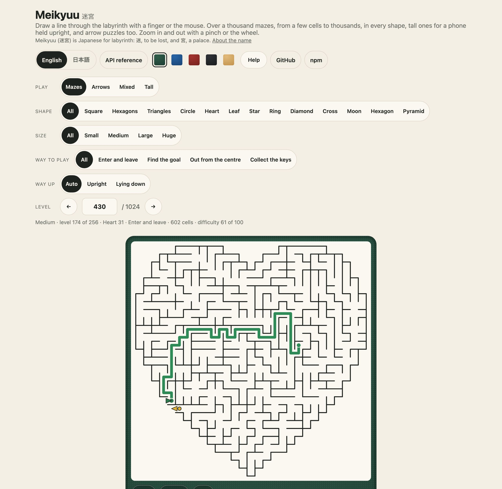
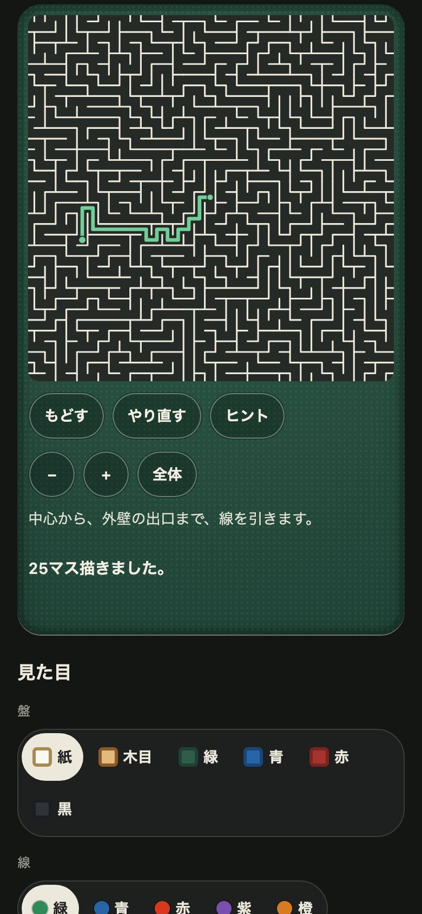
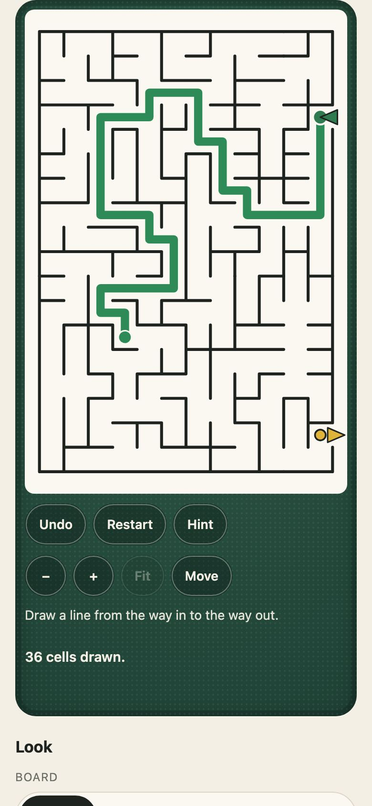
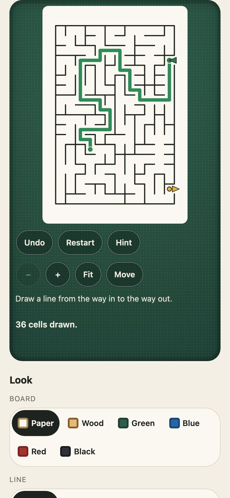
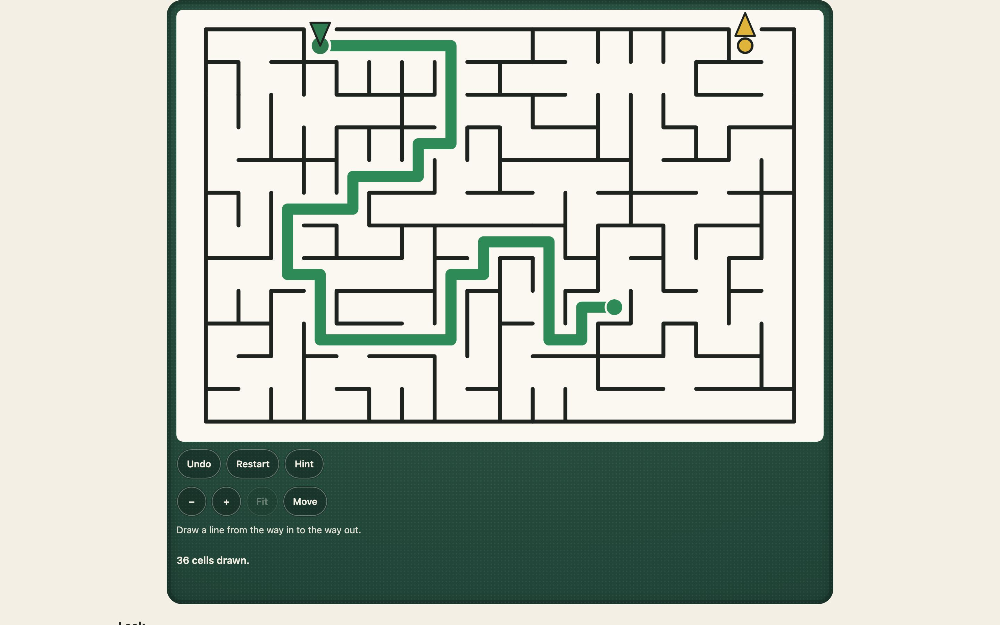

<h1 align="center">Meikyuu <sub>迷宮</sub></h1>

<p align="center"><strong>A maze game for JavaScript and TypeScript.</strong><br>
Draw a line through over a thousand mazes, and as many tall ones for a phone held upright, with a finger or the mouse: squares, hexagons, triangles, circles and shapes cut out of them (a heart, a leaf, a star), from a few cells to thousands, each level a short recipe that rebuilds the same maze in every browser. Seven algorithms, a difficulty measure, a score for how hard each is to play, lists that never get easier, zoom and pan, and arrow puzzles too. The maze drawn as SVG and played in any page with one call or one tag. No dependencies.</p>

<p align="center">
  <a href="https://github.com/johnmorrisdotca/meikyuu/actions/workflows/ci.yml"></a>
  <a href="https://www.npmjs.com/package/@johnmorrisdotca/meikyuu"></a>
  <a href="./LICENSE"></a>
  
</p>

<p align="center"><a href="https://johnmorrisdotca.github.io/meikyuu/"><strong>Play a level →</strong></a> · <a href="https://johnmorrisdotca.github.io/meikyuu/api.html">API reference</a></p>

<p align="center">
  
  
</p>

Meikyuu is a maze you draw through. Press the start and drag: the line follows the corridors, snaps to cells,
cannot pass a wall, and drawing back shortens it. The levels run from a three-by-three that takes a moment to
mazes of thousands of cells that take a good while, zoomed with a pinch or the wheel and moved with two fingers.
It is a package for making, drawing and playing mazes of any shape, and the game built from it, which is in
[the demo](https://johnmorrisdotca.github.io/meikyuu/) with nothing to install.

## In 30 seconds

```sh
npm install @johnmorrisdotca/meikyuu
```

```ts
import { buildMaze, measureMaze, newMazeGame, playSolution, solutionOf } from "@johnmorrisdotca/meikyuu";
import { MEIKYUU_MAZE_LEVELS } from "@johnmorrisdotca/meikyuu/levels";

const level = MEIKYUU_MAZE_LEVELS[11];        // level 12: a recipe, "square:4x4:…", never a drawing
const maze = buildMaze(level.recipe);          // the same maze in every browser and every Node
measureMaze(maze).effort;                      // about how many cells a person draws to solve it
solutionOf(maze);                              // the one way from the start to the goal, cell by cell
playSolution(newMazeGame(maze)).solved;        // true: the game's own rules, a cell at a time
```

And in a page, a level to play, by touch and mouse, with nothing else to set up:

```html
<script type="module" src="https://cdn.jsdelivr.net/npm/@johnmorrisdotca/meikyuu@2/dist/element-define.js"></script>
<meikyuu-board level="40" board="wood" tap></meikyuu-board>
```

## Who it is for

- **Game and puzzle sites** that want a maze game with the rules already right: levels everybody plays alike,
  in order of difficulty, a line a finger can draw, zoom for the big ones, and its words in English and Japanese.
- **Anyone making mazes**, who wants one generator that runs over any cell graph, seven algorithms to choose a texture from,
  shapes cut out of a grid, and a measure of how hard what came out is.
- **Pages that just want a picture**: a maze, with its line and its solution, drawn as SVG text with no page needed.

## Features

- **A thousand mazes, then arrow puzzles and mixed ones.** 1,024 maze levels, 300 arrow levels and 100 mixed levels: four sizes of 256 mazes, each size ordered by effort so that no level is easier to draw than the one before, and each scored 0 to 100 for how hard it is to play.
- **Tall mazes for a phone held upright.** 1,536 portrait levels, two columns to three rows, in six sizes of 256 (6×9 to 20×30 cells), that lie down by themselves on a wide screen (`orientation`) without changing the maze or a line drawn on it.
- **Colossal mazes.** Two more lists, in an entry of their own (`/levels/colossal`): 128 square mazes of about ten thousand cells (a hundred across or so, every shape) and 128 tall ones 64 across and 96 down, each a recipe that builds in about twenty milliseconds, drawn and played with the same zoom, gutters and panning as any other.
- **Stones.** A marble (`stones` option) laid beside the line on a passage the player has given up on, which the line cannot enter: a helper for the big mazes, never a pen. Laid only within `reach` cells of the line (2 by default), as many as `limit` allows (a few, or none for no limit), by the Stone button, by pressing and holding, or by Shift and an arrow key. Part of the game for Undo, Restart and saving a run, never part of the maze or its answer.
- **Made for a thumb.** Always some page beside the board to scroll by, touches kept only by the board, a pinch to zoom, two fingers to move a zoomed maze, and the view following a line drawn to the edge.
- **Every shape.** Squares, hexagons, triangles and circles, and shapes cut out of them (a heart, a leaf, a star, a ring, a diamond, a cross, a moon), from a few cells to thousands.
- **Four ways to play**: in and out through the wall, find the goal, out from the centre, and collect the keys on the way.
- **Seven algorithms** with a texture each, one generator over any cell graph, and a measure of how hard what came out is.
- **A level is a recipe**, a short string that rebuilds the same maze in every browser and every Node, for ever. Never a drawing.
- **Drawn as SVG text**, in an entry of its own: six boards and five line colours, with the maze, the line, a hint and the solution.
- **Played by drawing a line** with a finger or the mouse: it follows the corridors, cannot pass a wall, and drawing back shortens it. Zoom and pan for the big ones, a hint, undo, and keys on the keyboard, as one function call (`mountMeikyuu`) or one tag (`<meikyuu-board>`).
- **Optional sounds**, made in the browser by the Web Audio API: no recordings, so nothing to fetch and nothing to credit.
- **Reduced motion respected**, and nothing the player touches can be selected.
- **English and Japanese** in the board's words, the shapes' names and the demo.
- **No dependencies**, no network requests, and nothing stored outside the page it is in.

## The ways to play

Each is a declared field of a level, never inferred from the shape. A way to play decides where the line starts and ends.

| `mode` | The way it is played |
| --- | --- |
| `enter-leave` | In at one door in the outer wall, out at another, the two as far apart as the maze allows. |
| `to-goal` | From a cell inside the maze to a dot hidden deep in it. |
| `centre-out` | From the middle of the shape out through a door in the outer wall. |
| `keys` | From inside, picking up every key on the way to a door in the outer wall. A key is at the end of a branch, off the way, so each costs a detour. It is picked up by passing over it, and stays picked up when the line is drawn back. |

Beside the mazes there are two more kinds, each with its own list of levels (`MeikyuuKind`: `maze`, `arrows`, `mixed`):

- **Arrow puzzles.** A picture (a heart, a leaf, a star) made of arrow paths. Tap an arrow and it slides off the board the
  way its head points, if nothing is in its way; if another arrow is, it bumps and a heart is lost. Clear every arrow. Every puzzle can be
  cleared: each is built backwards, adding arrows that each have a clear way out at the moment they are added.
- **Mixed puzzles.** An arrow puzzle in which some arrows are locked, and a labyrinth beside it with an unlock button hidden deep inside.
  Draw a line through the labyrinth to the button and the locked arrows are freed. In the order of play these come after the plain ones.

## The shapes

A maze is made on a cell graph, so it can be made on anything. Squares, hexagons, triangles and circles are graphs of their
own; the rest are one of those with a shape cut out.

| `shape` | What it is |
| --- | --- |
| `square` | Square cells, columns by rows. |
| `hex` | Hexagonal cells, pointy side up, every other row shifted: six neighbours. |
| `triangle` | Triangular cells, pointing up and down in turn: three neighbours. |
| `circle` | Rings round a middle cell, a ring having more cells the further out it is; walls between rings are arcs. |
| `heart`, `leaf`, `star`, `ring`, `diamond`, `cross`, `moon` | Square cells inside an outline, the biggest piece of them that is joined. |
| `hexagon` | A hexagon of hexagonal cells. |
| `pyramid` | A big triangle of triangular cells. |

`docs/MAZES.md` has the research: how each is laid out, how the algorithms differ, and how difficulty is measured, with links.

The seven algorithms (`MeikyuuAlgorithm`) each make a perfect maze, one with exactly one way between any two cells, with a texture of its own:

| `algorithm` | Texture |
| --- | --- |
| `backtracker` | Long winding passages and very few dead ends: a long, tiring solution. |
| `hunt` | Hunt-and-kill: much the same, a little less winding. |
| `growing` | Growing tree, newest cell half the time and a random one the rest: in between. |
| `prim` | Randomized Prim: very many short dead ends, a short solution. |
| `kruskal` | Many short dead ends, evenly spread. |
| `wilson` | Loop-erased random walks: every maze equally likely, so no texture of its own. |
| `eller` | Row by row: horizontal runs. Square mazes only. |

## Levels and how difficulty is measured

There are 1,024 maze levels, 300 arrow levels and 100 mixed levels, and 1,536 tall maze levels in a list of their own (below). The maze list is four sizes of 256, small, medium, large and huge, in that order; inside a size every level is at least as much to draw as the one before (the effort below), and gets harder to play (the score below). The arrow and mixed lists are one list each, ordered by their effort.
A level is a recipe, such as `square:12x9:wilson:to-goal:48213` (shape, size, algorithm, way to play, seed) or `heart:25:prim:keys-3:7`, never a drawing. A recipe rebuilds
the same maze every time, on every browser, because every choice a generator makes comes from a seeded integer stream (mulberry32) and none from the geometry.
The lists are made on a desk by `scripts/meikyuu-levels.ts` and `scripts/meikyuu-tall.ts` and kept as data in `src/levels/`. `docs/LEVELS.md` has the tables: how many levels there are in every size and third, how hard they are, how many more could be made, and what became of the 1.0.0 list.

- **Small and quick first, huge and slow last.** Level 1 is a 15-cell maze; level 1,024 has 7,744 cells. 256 levels are small (under 150 cells), 256 medium (under 800), 256 large (under 4,000) and 256 huge. A size is sixteen pages of sixteen levels, and a third of it (86, 85 and 85 levels) is its easy, medium and hard.
- **Mixed.** The shapes and the ways to play arrive as the small list goes on (squares first, then circles, hexagons, triangles, and the cut-out shapes one after another; in and out first, then the goal, the centre and keys), and every size has all of them.
  Maze levels by shape: square 156, hex 90, circle 85, triangle 77, heart 74, leaf 74, hexagon 74, pyramid 73, diamond 72, star 67, cross 66, ring 65, moon 51; by way to play: `to-goal` 268, `centre-out` 262, `keys` 253, `enter-leave` 241.
- **Difficulty is measured twice.** `measureMaze` counts the passages alone, in whole numbers: the cells on the way through, the places on it where the line could have gone another way, the lengths of the wrong branches that leave it, the dead ends, the `river` (the share of cells with exactly two passages), and for keys the detour to fetch them. They are added to an `effort`, an estimate in cells drawn: the way, plus the wrong turns (a person at a fork goes the wrong way half the time and walks to the end of it and back), plus two for every fork, plus the keys. `ratingOf` puts it on a scale of 1 to 100 where doubling the effort adds the same each time.
- **And scored** (`difficultyOf`, 0 to 100): effort says how much there is to draw, which is mostly size; the score adds what makes two mazes of one size easy or tricky: the forks, the forks where *the straight guess* is wrong (at every fork take the passage that points most nearly at the goal), the cells that guess draws that it need not, the longest wrong branch and the bends. Forty per cent is the effort and sixty is the rest, each on a log scale against the biggest the lists reach. A maze whose straight guess walks to the goal is not a level: `isTooEasy` holds every one to at least 4 wasted cells, 2 traps, 3 forks, 3 wrong branches and 4 dead ends, and the easy third of a size to a floor that rises through it (`easyFloorAt`: 3 traps, 5 forks and 8 wasted cells by level 86). `docs/LEVELS.md` explains the choices and shows the score of every level.
- **Tested on every build**: every level rebuilds from its recipe, is a perfect maze of the cells the list says, measures the effort and the score the list says, is not too easy for its place, and is solved by drawing its way with the game's own rules; and the efforts never go down along a size.

```ts
import { levelOf, findMazeLevels, MEIKYUU_ARROW_LEVELS } from "@johnmorrisdotca/meikyuu/levels";

levelOf("maze", 40);                                   // { number, code, recipe, effort, rating, cells }
findMazeLevels({ shape: "heart", mode: "keys" });      // the heart levels you collect keys in
mazeLevelOfSize("medium", 40);                         // level 40 of the 256 medium mazes
MEIKYUU_ARROW_LEVELS[0].recipe;                        // { shape: "square", w: 3, h: 4, longest: 2, seed: …, … }
```

## Colossal mazes

The biggest the lists go: about **ten thousand cells**, where the biggest of the other lists has 8,923 and most have far fewer. There are two lists of 128 levels, in an entry of their own so a page that does not play them does not carry them:

```ts
import { MEIKYUU_COLOSSAL_LEVELS, MEIKYUU_COLOSSAL_TALL_LEVELS, colossalLevelOf } from "@johnmorrisdotca/meikyuu/levels/colossal";
import { mountMeikyuu } from "@johnmorrisdotca/meikyuu/play";

const level = colossalLevelOf(40)!;                       // level 40 of the 128 square colossal mazes, about 10,000 cells
mountMeikyuu(host, { recipe: level.code, ratio: level.ratio });
const tall = MEIKYUU_COLOSSAL_TALL_LEVELS[0]!;            // 64 across and 96 down for a square one, 2:3, for a phone held upright
mountMeikyuu(host, { recipe: tall.code, ratio: tall.ratio });
```

- **The square list** is 9,500 to 12,000 cells in every shape (`square` is a hundred across or so) and every way to play; **the tall list** is `square` 64×96, and hexagons and triangles laid out to fill the same 2:3 container (`tallDimensions`), about 6,100 cells. Each list is in order of the effort its levels measure, as every list is, and scored by the same `difficultyOf`. The scale is the one the older lists use, so a colossal maze scores high (most 84 to 98) and a colossal level is harder than every huge one at the top.
- **The list is recipes, not mazes.** 256 recipes are 20 KB. A maze is built from its seed where it is played, about 20 to 30 ms in a browser for ten thousand cells (`buildMaze`), so nothing is generated ahead and nothing is stored: a list that held the mazes would be megabytes.
- **Drawn and played as any other.** Only the walls on screen are in the page (tiles of a few cells), a line is one path, and nothing else is drawn per cell, so a line of thousands of cells stays smooth: see `docs/LEVELS.md` for the frame cost measured on a phone-sized Chromium.
- Made by `node --experimental-strip-types scripts/meikyuu-colossal.ts` (about six minutes), seeded, into `src/levels/colossal.data.ts`.

## Stones

A big maze is hard to hold in the head. A **stone** is a marble the player lays on a passage cell to say that the line will not go there: a dead end found, shut. It is deliberately not a pen. A stone may only be laid

- **beside the line**: on an open passage cell joined by passages to a cell of the line within `reach` steps (1 or 2, default 2: next to the line, or one cell beyond that), not counting a way through another stone, so never across a wall and never out in the middle of the maze;
- **on a cell the line is not on**, and not on the start or the goal;
- **while stones are left**: `limit` stones may lie at once (`stoneLimitFor(cells)` by default: 4 for a small maze, 9 for a huge one, 13 for a colossal one; `limit: null` for no limit); and not once the maze is solved.

The line cannot enter a stone's cell, and a stone is taken up by asking for it again (which gives it back). Stones belong to the game: **Undo** takes a laid stone up and puts a taken one back, **Restart** takes every stone up, `mount.run()` and `mount.restore(code)` (or `encodeRun` / `decodeRun`) keep a run with its stones as one short text, and a stone is never part of the maze, its recipe, its answer or any check (the maze is solved by the same line whatever stones lie).

```ts
const board = mountMeikyuu(host, { level: 40, stones: { limit: 5, reach: 2 } });   // or `stones: true` for the defaults, `limit: null` for no limit
board?.stoneMode(true);        // a tap on a cell lays a stone (or takes the one there up), and nothing draws
board?.stones();               // the cells with a stone
board?.stonesLeft();           // 3, or null with no limit
board?.clearStones();          // one Undo puts them back
const saved = board?.run();    // "0231~1a.2f": the line's steps, a tilde, the stones' cells in base 36
board?.restore(saved!);        // the same line and stones, with one Undo that takes them all back
host.addEventListener("meikyuu-stones", (event) => console.log((event as CustomEvent).detail.stonesLeft));
```

Three ways to lay one, none of which needs the button: **the Stone mode** (the board's own Stone button, or `mount.stoneMode(true)` from a button of your own: while it is on a one-finger drag only moves the view and a tap lays or takes up a stone), **press and hold** (a finger or the mouse held still on a cell for about half a second lays a stone there, or takes up the one there, whatever the mode; a hold on the line itself is a pause, and does nothing), and **Shift and an arrow key** beside the end of the line. A refusal says why in the board's words (`stoneFar`, `stoneOnLine`, `stoneLimit`, ...) and a hold with no line to lay beside says nothing. The marble is drawn as `.mk-stone` with a `.mk-gleam` (`--mk-stone`, `--mk-stone-edge`; `drawMaze` takes `stones`), and the element has `stones`, `stone-limit` (a number or `none`) and `stone-reach`.

## Tall mazes, turning and touch

A phone held upright leaves a box about two thirds as wide as it is tall (a 390 by 844 phone, less the page's header and the board's buttons, leaves about 342 by 560 with a gutter each side), so the tall levels are **2:3**, width to height. A 1:2 tower fits the same phone at 82% of the width, and a 1:1 square at 100% but 50% fewer cells at the same cell size; `docs/LEVELS.md` has the table for five phones. Squares are 6×9 up to 20×30; hexagons and triangles are laid out to fill the same container.

```ts
import { MEIKYUU_TALL_LEVELS, tallLevelOfSize } from "@johnmorrisdotca/meikyuu/levels/tall";
import { mountMeikyuu } from "@johnmorrisdotca/meikyuu/play";

const level = tallLevelOfSize(4, 40)!;                               // level 40 of the 256 12×18 mazes
const board = mountMeikyuu(host, { recipe: level.code, ratio: level.ratio });   // orientation: "auto" is the default
board?.orientation("landscape");                                      // or "portrait", or "auto"
```

<p align="center">  </p>

- **Turning is presentation only.** `orientation` is `portrait`, `landscape` or `auto` (the default: lay a tall maze down when the host's width and the window's height fit it bigger that way, so a phone upright keeps it upright, a phone on its side or a desk lies it down, and a square room or a square maze is left alone). The picture is turned a quarter counter-clockwise (the maze's top ends up on the left); the maze, its cells and the line are as they were made, and every point a finger gives is carried back into the maze before the game hears of it. A line stored as its steps (`lineToSteps`, `stepsToLine`) is the same line on a board turned either way, so a level can be started on a phone and finished on a desk. `drawMaze` takes `orientation` too; `mount.orientation()` says what it came to, and `meikyuu-orientation` fires when the window changes it. The host adds a choice with `mount.orientation(setting)`, or the pad's Turn button (`turnButton`).
- **There is always page beside the board** to scroll by. The box is never wider than the window less `gutter` each side (24 px), and never taller than the window less `reserve` (200 px; not under 60% of it). Only the box asks the browser to keep touches (`touch-action: none`); the host has `pan-y pinch-zoom`, so a swipe anywhere else scrolls the page, and a finger drawing never does.
- **Zoom out as far as the page lets you.** Zoom out (the pad's − or two fingers coming together) first shrinks the maze to a little past the fit, and then widens the gutters a step at a time, to 72 px each side; Zoom in (or fingers apart) brings the gutters in first. `mount.gutter(px)` sets it, and Fit puts it back.
- **Fit** is the whole maze (`both`, default), or its `width` or `height` (`fit` option, `mount.fit(mode)`), from the top or left where the maze is bigger than the box.
- **One finger draws, two move the view.** Two fingers pan and pinch a zoomed maze; one finger pressed away from the end of the line moves the view as a hand moves a map; the Move button (`mount.pan(true)`, `pan` option) makes every one-finger drag move the view, for a mouse or a finger that cannot find the line's end.
- **A line drawn to the edge moves the view along**, gently (nothing 44 px from the edge, rising to a few pixels a frame at the edge itself); `edgePan: false` (`mount.edgePan(false)`, `edge-pan="off"`) turns it off.

## Use it in your project

Entry points, so a page loads only what it uses:

| Entry | What is in it |
| --- | --- |
| `@johnmorrisdotca/meikyuu` | The rules and the making, no page needed: grids, algorithms, mazes, the measure, the game, arrows, mixed puzzles, recipe codes |
| `@johnmorrisdotca/meikyuu/draw` | A maze or an arrow board as SVG text, the boards and line colours, the style, the words in English and Japanese |
| `@johnmorrisdotca/meikyuu/play` | `mountMeikyuu`, the style of a playable board, the sounds, the arithmetic of zoom and pan |
| `@johnmorrisdotca/meikyuu/element` | The `<meikyuu-board>` class |
| `@johnmorrisdotca/meikyuu/element/define` | Defines the tag on the page, for its effect |
| `@johnmorrisdotca/meikyuu/levels` | The three numbered lists of levels, and finding a level |
| `@johnmorrisdotca/meikyuu/levels/tall` | The 1,536 tall (portrait) maze levels, in six sizes |
| `@johnmorrisdotca/meikyuu/levels/colossal` | The 256 colossal maze levels (about ten thousand cells): 128 square and 128 tall |
| `@johnmorrisdotca/meikyuu/levels/legacy` | The 1,000 maze levels of 1.0.0, and where each went |

```ts
import { buildMaze, carveMaze, gridOf, MEIKYUU_SHAPES } from "@johnmorrisdotca/meikyuu";

const maze = buildMaze({ shape: "hexagon", w: 6, h: 6, algorithm: "kruskal", mode: "centre-out", seed: 3 });
maze.grid.cells;                 // 127
maze.links[maze.start];          // the cells the start is joined to
maze.exit;                       // { cell, side }: the door in the outer wall
```

`gridOf(shape, w, h)` is a cell graph (`Grid`): each cell's `neighbours`, its `sides` (the wall across each) and `at(x, y)` for the cell at a point. A shape of your own is a function that makes one;
`carveMaze(grid, algorithm, random)` then makes a perfect maze on it. `isPerfect` checks one.

### The game as functions

A line drawn through a maze is a game, and every move is a pure function that returns a new game (or the same one when nothing changed), so a server, a page and a test play by the same rules:

```ts
import { newMazeGame, pressMaze, dragMaze, liftMaze, undoMaze, tapMaze, hintMaze } from "@johnmorrisdotca/meikyuu";

let game = newMazeGame(maze);
game = pressMaze(game, maze.start);   // a finger down on the start begins a stroke
game = dragMaze(game, nextCell);      // into each cell it enters: a wall, or a cell not next to the line, is ignored
game = liftMaze(game);                // the stroke is over, and Undo takes it back
hintMaze(game).cells;                 // the next stretch of the right way, and how many cells to draw back first
```

A cell the line is on again cuts the line back to it, so a line never crosses itself. Arrow puzzles are `newArrowGame`, `tapArrow` (`removed`, `blocked`, `locked`), `heldByLocks`, `hintArrow`, `undoArrow`, and mixed ones are `buildMixed` with `withMaze`
unlocking the arrows when the labyrinth's button is reached.

### On a server, in a page and in a framework

A server that wants to trust a level takes a recipe and rebuilds the maze, with no page at all:

```ts
import { buildMaze, parseRecipe, solutionOf } from "@johnmorrisdotca/meikyuu";

const recipe = parseRecipe(codeFromTheBrowser);        // null when it is not a recipe
if (recipe === null) throw new Error("not a maze this site makes");   // also null for a maze past MEIKYUU_MOST_CELLS
const solution = solutionOf(buildMaze(recipe));        // the one way through, cell by cell
```

(A recipe names its own size, so `parseRecipe` refuses one that would lay out more than `MEIKYUU_MOST_CELLS` cells, or ask for more than `MEIKYUU_MOST_KEYS` keys, before anything is built. A server that wants a lower ceiling checks `layoutCells(recipe.shape, recipe.w, recipe.h)` itself.)

One tag, no bundler:

```html
<script type="module" src="https://cdn.jsdelivr.net/npm/@johnmorrisdotca/meikyuu@2/dist/element-define.js"></script>
<meikyuu-board level="40" board="wood"></meikyuu-board>
<script>
  document.querySelector("meikyuu-board").addEventListener("meikyuu-solve", (event) => console.log(event.detail.moves));
</script>
```

With a bundler, `import "@johnmorrisdotca/meikyuu/element/define"` once, in code that runs in the browser, and `<meikyuu-board>` is a tag like any other. The tag draws itself in the page's own DOM, so the page's CSS reaches it. Its attributes are read again when they change, and it speaks through DOM events (`meikyuu-move`, `meikyuu-solve`, `meikyuu-key`, `meikyuu-unlock`, `meikyuu-bump`, `meikyuu-lose`) that carry a `detail`.

```jsx
// React 19
import { useEffect, useRef } from "react";
import "@johnmorrisdotca/meikyuu/element/define";

export function Maze({ level, onSolved }) {
  const board = useRef(null);
  useEffect(() => {
    const listen = (event) => onSolved(event.detail.moves);
    board.current?.addEventListener("meikyuu-solve", listen);
    return () => board.current?.removeEventListener("meikyuu-solve", listen);
  }, [onSolved]);
  return <meikyuu-board ref={board} level={String(level)} board="wood" />;
}
```

```vue
<!-- Vue 3: tell the compiler the tag is not a Vue component -->
<script setup>
import "@johnmorrisdotca/meikyuu/element/define";
defineProps({ level: Number });
</script>
<template>
  <meikyuu-board :level="level" board="wood" @meikyuu-solve="(event) => console.log(event.detail.moves)" />
</template>
<!-- in vite.config: vue({ template: { compilerOptions: { isCustomElement: (tag) => tag.startsWith("meikyuu-") } } }) -->
```

```svelte
<!-- Svelte 5 -->
<script>
  import "@johnmorrisdotca/meikyuu/element/define";
  let { level } = $props();
  let board;
  $effect(() => {
    const listen = (event) => console.log(event.detail.moves);
    board.addEventListener("meikyuu-solve", listen);
    return () => board.removeEventListener("meikyuu-solve", listen);
  });
</script>
<meikyuu-board bind:this={board} level={level} board="wood"></meikyuu-board>
```

```ts
// Angular: a standalone component with CUSTOM_ELEMENTS_SCHEMA
import { Component, CUSTOM_ELEMENTS_SCHEMA } from "@angular/core";
import "@johnmorrisdotca/meikyuu/element/define";

@Component({
  selector: "app-maze",
  standalone: true,
  schemas: [CUSTOM_ELEMENTS_SCHEMA],
  template: `<meikyuu-board level="40" board="wood" (meikyuu-solve)="solved($event)"></meikyuu-board>`,
})
export class Maze {
  solved(event: Event) { console.log((event as CustomEvent).detail.moves); }
}
```

In Next.js or any server-rendering framework, import the define entry from a client component, so the tag is defined in the browser. Or skip the tag and call `mountMeikyuu(element, options)` from `@johnmorrisdotca/meikyuu/play` in an effect: the handle it returns has `destroy()`.

These recipes are written to the tag's documented attributes and events; they are not built from the packed tarball by this repository's tests, which play the tag in a bare page in Chromium and WebKit.

## Drawing

```ts
import { drawMaze, drawArrows, MEIKYUU_STYLE } from "@johnmorrisdotca/meikyuu/draw";

const svg = drawMaze(maze, { path: solutionOf(maze).slice(0, 20), hint: { cells: [] }, board: "wood", trail: "blue", standalone: true });
```

`drawMaze` returns SVG text: put it in a page, a file or an image. One unit in the drawing is one cell. The walls are one path and the line another; the start,
the goal or the doors, and the keys are marks. Colours are generic: it knows nothing of any site.

| Option | Values | What it does |
| --- | --- | --- |
| `path` | cells | the line drawn so far, from the start |
| `collected` | cells | the keys picked up, drawn faint |
| `solution` | boolean | draw the one way from the start to the goal |
| `hint` | `{ back?, cells }` | cells to light as a hint |
| `won` | boolean | the line wears the colour of a win, and `data-won="true"` |
| `board` | `paper` (default), `wood`, `green`, `blue`, `red`, `black`, or a `MeikyuuBoardLook` | the paper, the walls and the frame; `paper` takes its colours from the page's light or dark |
| `trail` | `green` (default), `blue`, `red`, `violet`, `orange`, or any CSS colour | the line's colour |
| `wall`, `line` | cells | how thick a wall and the line are; defaults 0.12 and 0.34 |
| `language` | `en` (default), `ja` | what a screen reader hears |
| `label`, `standalone`, `pad` | | a description instead of the default; `standalone` puts the style inside, so the drawing is a picture on its own; the margin round the shape |

Every colour is also a custom property on `.meikyuu` (`--mk-paper`, `--mk-wall`, `--mk-frame`, `--mk-trail`, `--mk-start`, `--mk-goal`, `--mk-key`, `--mk-hint`, `--mk-bad`, `--mk-stone`, `--mk-stone-edge`), so a page sets only what it wants different.
The parts carry classes and data attributes: `mk-walls`, `mk-trail`, `mk-head`, `mk-start`, `mk-goal`, `mk-door` (`data-door="in"` or `"out"`), `mk-key` (`data-got`), `mk-hint`. Nothing in the drawing can be selected,
dragged or double-tapped into a selection, and with reduced motion asked for nothing moves. `drawArrows(board, { present, unlocked, hint })` draws an arrow board the same way, each arrow a group with `data-id`, `data-dir` and `data-locked`.

## Playing it in a page

```ts
import { mountMeikyuu } from "@johnmorrisdotca/meikyuu/play";

const board = mountMeikyuu(document.getElementById("here")!, { kind: "maze", level: 40, tap: true, sound: false });
board?.host.addEventListener("meikyuu-solve", (event) => console.log((event as CustomEvent).detail));
board?.load({ kind: "arrows", level: 5 });   // another puzzle in the same box
```

- **Drawing a path.** Press the start (or the end of the line) and drag. The line follows the corridors and snaps to cells; a wall stops it and drawing back shortens it. A fast drag that skips cells is followed through each cell it crosses. With `tap`, a tap on the maze runs the line along the corridor toward the tapped cell as far as the next fork, and never decides a fork for you.
- **Zoom and pan.** Pinch or the wheel zooms about the fingers or the cursor, two fingers move the view, and so does a drag that starts anywhere but on the start or the end of the line. The Fit button brings the whole maze back, and the zoom pad has + and −. A line drawn near an edge of the box moves the view along with it. A big maze stays smooth on a phone: its walls are cut into tiles that are in the page only while they are on screen.
- **Buttons.** Undo takes back the last stroke, Restart clears the line, and Hint lights the next stretch of the right way (and, if the line has gone into a wrong branch, how far to draw back). The arrow keys step the line, Backspace and Ctrl+Z undo.
- **Solved.** The line takes the colour of a win, a banner comes in and `meikyuu-solve` is fired once. With `prefers-reduced-motion` nothing moves.
- **Arrows.** Tap an arrow. A free one slides away along its line, a blocked one shakes and shows what is in its way and costs a heart, a locked one tells you where its button is and costs nothing, and so does one that nothing can free until the unlock (a locked arrow is in its way, or in the way of what is). Three hearts. A mixed puzzle has two tabs, the arrows and the labyrinth; what has just happened is said on the tab it happened on, and a puzzle out of hearts says so on both until the arrows are restarted (a restart keeps the unlock).
- **Events**, on the host and as callbacks: `meikyuu-move` (after each stroke or each arrow tapped), `meikyuu-solve` (once), `meikyuu-key`, `meikyuu-unlock`, `meikyuu-bump`, `meikyuu-lose`, and `meikyuu-stones` (a stone laid, taken up, cleared, undone or restored). Each carries `{ kind, level, moves, cells, keys, keysOf, hearts, arrowsLeft, solved, stones, stonesLeft }`.
- **Words** in English and Japanese, following the page's `lang`.
- **A steady box.** The board is one shape (a square, or the `ratio` asked for) whatever is in it, and nothing on the play surface can be selected. The lines of words under it keep the room their longest wording takes, so nothing moves as they change.
- **Sounds**, off unless `sound` is on: short tones made in the browser by the Web Audio API for a step, drawing back, a key, a bump, an arrow flying, an unlock, a win and a loss. There are no recordings, so there is nothing to fetch and nothing to credit.

| Option | Values | What it does |
| --- | --- | --- |
| `kind`, `level` | `maze`, `arrows` or `mixed`; a number from 1 | a level of the package's own lists |
| `recipe` | a code or an object | a puzzle of your own instead of a level |
| `board`, `trail`, `wall`, `line` | as in drawing | how it looks |
| `tap` | boolean, default false | a tap runs the line to the next fork |
| `hints` | boolean, default true | offer the Hint button |
| `controls` | boolean, default true | the buttons and the lines of words under the board |
| `zoom` | boolean, default true | the zoom pad (the wheel and the pinch always work) |
| `ratio` | `square` (default), `maze`, or width over height such as `2 / 3` | the shape of the box, as the maze was made; `level.ratio` for the tall levels |
| `orientation` | `auto` (default), `portrait`, `landscape` | which way up the maze is shown |
| `gutter`, `reserve` | pixels, default 24 and 200 | the page left beside the box; what else the window holds |
| `fit` | `both` (default), `width`, `height` | what Fit shows |
| `edgePan` | boolean, default true | a line drawn to the edge moves the view along |
| `pan` | boolean, default false | every one-finger drag moves the view |
| `turnButton` | boolean, default false | a Turn button in the pad, for a maze that is not square |
| `stones` | `true`, or `{ limit?, reach? }`; default off | stones to lay beside the line (see Stones); adds the Stone button |
| `sound` | boolean, default false | make a sound for each thing that happens |
| `language` | `en`, `ja` | the language; left out, the host's own `lang`, or the page's |
| `onMove`, `onSolve`, `onKey`, `onUnlock`, `onBump`, `onLose`, `onStones` | callbacks | what the events tell, as callbacks |

The handle: `load`, `set`, `undo`, `restart`, `hint`, `fit(mode?)`, `zoomIn`, `zoomOut`, `gutter(px?)`, `pan(on?)`, `edgePan(on?)`, `orientation(setting?)`, `show("arrows" | "maze")`, `mazeGame()`, `arrowGame()`, `stoneMode(on?)`, `stones()`, `stonesLeft()`, `stone(cell)`, `clearStones()`, `run()`, `restore(code)`, `destroy()`.

### The element

```html
<meikyuu-board level="40"></meikyuu-board>
<meikyuu-board kind="arrows" level="5" board="wood"></meikyuu-board>
<meikyuu-board recipe="heart:25:wilson:to-goal:5" tap></meikyuu-board>
```

Attributes, each read again when it changes: `kind` and `level`, or `recipe`; `board`, `trail`; `tap`; `hints` (`off` for no Hint button); `sound`; `controls` (`off` for only the board); `zoom` (`off` for no pad); `lang`; `ratio`, `orientation`, `gutter`, `reserve`, `fit`, `pan`, `edge-pan` (`off`), `turn-button`, `stones`, `stone-limit`, `stone-reach`.
Methods: `undo()`, `restart()`, `hint()`, `fit()`; `.mount` is the handle. `@johnmorrisdotca/meikyuu/element/define` defines the tag; `/element` holds the class alone.

## API

Every export of every entry point, with its signature and its doc comment, is in the
[API reference](https://johnmorrisdotca.github.io/meikyuu/api.html), made from the source when the site is built so it cannot fall behind the code.

## Making levels

`pnpm levels` runs `scripts/meikyuu-levels.ts`, which writes `src/levels/mazes.data.ts` (about a minute and a half); `node scripts/meikyuu-tall.ts` writes `tall.data.ts` (about a minute); `node --experimental-strip-types scripts/meikyuu-colossal.ts` writes `colossal.data.ts` (about six minutes); `node scripts/meikyuu-arrows.ts` writes `arrows.data.ts` and `mixed.data.ts` (about a minute).
All are seeded, so the same run writes the same files. A size keeps the places of the 1.0.0 list: a level that was good enough stays, a place that was too easy is given a new maze of about the same effort, a size with fewer than 256 is added to at the end, and one with more loses its end (`scripts/meikyuu-levels.ts`); the tall sizes are ramps of 256 steps of the effort (`scripts/levels-list.ts`). `node scripts/levels-facts.ts [--capacity]`, `levels-trees.ts`, `phone-fit.mjs` and `levels-charts.mjs` print and draw the tables and pictures of `docs/LEVELS.md`.
A level once published keeps its number: a published list is only ever added to at the end, never rewritten, **except by a release that says so**: 2.0.0 gave 117 places of the maze list a new maze and cut 40 off its end (CHANGELOG.md), and `@johnmorrisdotca/meikyuu/levels/legacy` says where each 1.0.0 level went.

## Theming

Nothing here is branded. The drawing and the playable board are coloured by custom properties, and a page sets only the ones it wants different. The default board, `paper`, follows the device's light or dark setting; `data-theme="light"` or `"dark"` on `<html>` forces one. A named board other than paper (`wood`, `green`, `blue`, `red`, `black`) writes its own paper, wall, frame and dots on the drawing, so to set those yourself keep the board `paper`; the line's colour (`trail`) is chosen by name (`green`, `blue`, `red`, `violet`, `orange`) or as any CSS colour, on any board.

**The drawing** (`drawMaze`, `drawArrows`), custom properties on `.meikyuu`. The dark values apply to the `paper` board:

| Property | What it colours | Light | Dark |
| --- | --- | --- | --- |
| `--mk-paper` | the paper | `#fbf8f1` | `#262a27` |
| `--mk-wall` | the walls (and the outline of the goal and the keys) | `#1f2320` | `#ece8dc` |
| `--mk-frame` | the frame round the shape | `#a98954` | `#6b5632` |
| `--mk-trail` | the line the player draws | `#2e8b57` | `#6fcf97` |
| `--mk-start` | the start, and an entrance door | `#2f7a4f` | `#6fcf97` |
| `--mk-goal` | the goal, an exit door, the solution when it is shown, and a solved line | `#e0b43b` | the same |
| `--mk-key` | a key | `#e0b43b` | the same |
| `--mk-hint` | the stretch a hint lights | `#f2a900` | the same |
| `--mk-bad` | a hint to draw back, and the arrows in a bump | `#b5452c` | the same |
| `--mk-stone` | a stone (a marble laid beside the line) | `#4b5d8f` | `#b3c0ea` |
| `--mk-stone-edge` | the rim of a stone | `#161c33` | `#0e1220` |
| `--mk-dot` | the faint dots of an arrow board | `rgba(0,0,0,.14)` | `rgba(255,255,255,.14)` |
| `--mk-ink` | set for a page that draws its own text over the board; no part of the drawing reads it yet | `#1f2320` | `#ece8dc` |

**The playable board** (`mountMeikyuu` and `<meikyuu-board>`) wears the drawing's properties, and eight of its own on `.meikyuu-play`:

| Property | What it colours | Light | Dark |
| --- | --- | --- | --- |
| `--mkp-ink` | text, the focus ring, and a selected tab | `#1f2320` | `#ece8dc` |
| `--mkp-muted` | the words under the board | `#6b6f68` | `#a09d93` |
| `--mkp-rule` | borders | `#ddd6c6` | `#3a3d38` |
| `--mkp-surface` | the buttons | `#fbf8f1` | `#1d201e` |
| `--mkp-accent` | the hearts, and a warning in the words under the board | `#b5452c` | `#ff8a6b` |
| `--mkp-good` | the progress line once solved | `#2f7a4f` | `#6fcf97` |
| `--mkp-gutter` | the page left beside the box, each side (`gutter` sets it) | `24px` | the same |
| `--mkp-reserve` | what the window holds besides the box (`reserve` sets it) | `200px` | the same |

```css
.meikyuu { --mk-goal: #d94f70; --mk-hint: #3b82f6; }
.meikyuu-play { --mkp-accent: #8a1c1c; }
```

The demo's own page is the worked example: its green felt and its cloth patches are the family's stylesheet, [`demo/family.css`](./demo/family.css), which is the same file byte for byte in every sibling's demo, and a test holds it to its hash. With reduced motion asked for, nothing in the board moves.

## Limits

All of these are held by tests, and the ones with a name are exported.

| Limit | Value | Where |
| --- | --- | --- |
| Levels | 1,024 maze levels, 300 arrow levels, 100 mixed | `MEIKYUU_MAZE_LEVELS`, `MEIKYUU_ARROW_LEVELS`, `MEIKYUU_MIXED_LEVELS` |
| Tall levels | 1,536, six sizes of 256 (6 to 20 cells across, 2:3) | `MEIKYUU_TALL_LEVELS`, `MEIKYUU_TALL_SIZES` |
| Colossal levels | 256, two lists of 128: square (9,500 to 12,000 cells) and tall (64 across, 96 down, 2:3) | `MEIKYUU_COLOSSAL_LEVELS`, `MEIKYUU_COLOSSAL_TALL_LEVELS` |
| Stones | beside the line within 1 or 2 cells (default 2); a few by default (3 and one more for every hundred cells across), or no limit | `stoneLimitFor`, `MEIKYUU_STONE_REACH_MOST` |
| The biggest maze in the lists | 8,923 cells (level 1002); the smallest is 15 (level 1) | `levelOf("maze", n).cells` |
| A maze's size words | small under 150 cells, medium under 800, large under 4,000, huge beyond | `sizeOf`, `MEIKYUU_SIZES` |
| A recipe's size | at least 2 a side, and at most 40,000 cells laid out (counting, for a shape cut out of a square, the whole square): a little over twice the biggest level's 19,321; `parseRecipe` refuses more | `MEIKYUU_MOST_CELLS`, `layoutCells` |
| Keys in a recipe | 10, twice the most any level uses | `MEIKYUU_MOST_KEYS` |
| An arrow board's size | at most 4,000 cells: a little over twice the biggest level's 1,849 | `MEIKYUU_MOST_ARROW_CELLS`, `parseArrowRecipe` |
| Shapes, ways to play, algorithms | 13 shapes, 4 ways to play, 7 algorithms (Eller's: square mazes only) | `MEIKYUU_SHAPES`, `MEIKYUU_MODES`, `MEIKYUU_ALGORITHMS` |
| Arrow boards | 8 pictures | `ARROW_SHAPES` |
| Hearts in an arrow puzzle | 3 | `ARROW_HEARTS` |
| Effort, the measure of difficulty | from 9 to 5,400, rated 1 to 100 | `EFFORT_LEAST`, `EFFORT_MOST`, `ratingOf` |
| Score, how hard a maze is to play | 0 to 100; a level is at least `MEIKYUU_LEAST` | `difficultyOf`, `isTooEasy` |
| The page beside the board | at least 24 px each side, widened to 72 px by Zoom out | `MEIKYUU_GUTTER`, `MEIKYUU_GUTTER_MAX` |
| How far a board zooms in | until a cell is 72 pixels wide, and out to the whole maze fitted | `MOST_CELL_PIXELS`, `scaleLimits` |

A maze of thousands of cells is cut into tiles on the page so that only the walls on screen are drawn: a big maze stays smooth on a phone.

## Browser support

Any browser with ES2020 modules, custom elements, Pointer Events, `ResizeObserver` and CSS `aspect-ratio`: Chrome and Edge 88, Safari 15, Firefox 89, all from 2021 on. The sounds need the Web Audio API and are off unless asked for. The element draws in the page's own DOM, with no shadow DOM. The demo is played in a real Chromium at a phone's width (with touch) and a desk's, and in WebKit, Safari's engine, at a phone's width, including pinch, wheel and drag; Firefox is not in that run. The package itself (the rules, the making and the levels) needs no DOM: it runs in Node 22 or later (CI tests 22 and 24). Deno and Bun are not tested.

## Languages

English and Japanese, chosen by the `language` option, the host's `lang` or the page's, and followed when the page's `lang` changes. The demo has a chooser of its own and takes the browser's language on a first visit. The board's words and the names of the shapes and the ways to play (`MEIKYUU_STRINGS`) are in both. **Japanese: included; not yet reviewed by a native reader. Corrections welcome.** Every string is listed beside its English in [docs/strings-ja.md](./docs/strings-ja.md), and there is an [issue template](https://github.com/johnmorrisdotca/meikyuu/issues/new?template=fix-a-translation.md) for fixing one. Any other language is a table of your own, passed beside these two.

## Architecture

Everything that decides a maze or a game is a plain function over a cell graph, with no DOM. The drawing is SVG text in an entry of its own,
so a server that only builds mazes never loads it, and the page's part (the mount and the element) is another.

```text
src/
├── index.ts          the main entry: the rules and the making, without the drawing, the page or the levels
├── random.ts         the seeded random numbers every maze is made from
├── grid.ts           a cell graph: cells, their neighbours and walls, and how a part of one is cut out
├── shapes.ts         the shapes: squares, hexagons, triangles, circles, and a hexagon and a pyramid cut from them
├── masks.ts          the outlines cut from a square grid: heart, leaf, star, ring, diamond, cross, moon
├── algorithms.ts     the seven ways to carve a perfect maze, over any grid
├── maze.ts           a maze: its recipe and its code, where each way to play puts the start, goal, doors and keys
├── measure.ts        how hard a maze is, counted off its passages, and the 1 to 100 rating
├── difficulty.ts     the 0 to 100 score of how hard a maze is to play, and the least a level must have
├── tall.ts           tall (2:3) mazes: the sizes, and the dimensions that fill a container in each shape
├── colossal.ts       colossal mazes (about ten thousand cells): how many, how big
├── stones.ts         stones: the rules of laying one beside the line, taking it up, and keeping a run with its stones
├── orientation.ts    which way up a maze is shown: the quarter turn, and carrying a finger's path back into the maze
├── steps.ts          a line as its steps, one character a step, the same on a board turned either way
├── game.ts           a line drawn through a maze as pure functions: press, drag, lift, tap, undo, hint
├── arrows.ts         arrow puzzles: made backwards so that all can be cleared, locked arrows, and their measure
├── arrowGame.ts      an arrow puzzle in play as pure functions: tapping, hearts, locks, hint, undo
├── mixed.ts          a mixed puzzle: arrows with locks, and a labyrinth whose button unlocks them
├── levels.ts         the "/levels" entry: the three lists, found by kind and number, and the maze list by size
├── levels-tall.ts    the "/levels/tall" entry: the 1,536 tall maze levels
├── levels-colossal.ts the "/levels/colossal" entry: the 256 colossal maze levels
├── levels-legacy.ts  the "/levels/legacy" entry: the 1.0.0 maze levels, and where each went
├── draw-entry.ts     the "/draw" entry: the drawing, its boards and colours, its style and its words
├── draw.ts           a maze as SVG text: walls, line, marks, hint, solution
├── drawArrows.ts     an arrow board as SVG text
├── geometry.ts       the paths a drawing is made of: walls, lines, doors
├── boards.ts         the boards a drawing sits on and the colours of its line
├── style.ts          the drawing's style: its colours as custom properties, and its few motions
├── strings.ts        the words, in English and Japanese, for a screen reader and for the board's buttons
├── play-entry.ts     the "/play" entry: a puzzle played in any element
├── mount.ts          mountMeikyuu: draws a puzzle into an element and plays it, with its buttons, words and events
├── surface.ts        the box a board is looked at through: pinch, wheel, pan, edge nudging, and hands the rest to the board
├── mazeSurface.ts    a maze in the box: tiled walls drawn only while in view, the line, the hint, the marks
├── arrowSurface.ts   an arrow board in the box: tapping an arrow, one sliding off, one bumping
├── viewport.ts       the arithmetic of zooming and moving a big board through its box
├── playStyle.ts      the style of a playable board: its box, buttons, words and tabs
├── sound.ts          the sounds, made in the browser
├── element.ts        the "/element" entry: the <meikyuu-board> class
├── element-define.ts the "/element/define" entry: defines the tag on the page
├── version.ts        the package's version
└── levels/
    ├── mazes.data.ts   the 1,024 maze levels, each a recipe with its effort, its cells and its score
    ├── tall.data.ts    the 1,536 tall levels, the same
    ├── colossal.data.ts the 256 colossal levels, the same
    ├── legacy.data.ts  the 1.0.0 maze levels, kept, with the score each is given now
    ├── arrows.data.ts  the arrow levels, each a recipe with its effort
    └── mixed.data.ts   the mixed levels, each two recipes with their effort
```

Tests sit beside the code they test (`*.test.ts`, and the maze list in eight files and the tall list in three so that they run side by side). `scripts/` makes the levels, builds the demo and its API reference page,
takes the pictures and checks the package as npm packs it; `demo/` is the playable page, and `e2e/` its browser tests.

## The name

*Meikyuu* (迷宮, 「めいきゅう」) is Japanese for a labyrinth. It is written with 迷, which
[Wiktionary](https://en.wiktionary.org/wiki/%E8%BF%B7) glosses as to get lost, to be bewildered, and 宮, a
[palace or a shrine](https://en.wiktionary.org/wiki/%E5%AE%AE): a bewildering palace. Wiktionary's entry for
[迷宮](https://en.wiktionary.org/wiki/%E8%BF%B7%E5%AE%AE) gives "maze, labyrinth", and notes the figurative
sense, as in 迷宮入り, a case that goes unsolved. It is also the word Japanese games use for the place the player
goes down into: the Japanese Wikipedia's article on [ダンジョン](https://ja.wikipedia.org/wiki/%E3%83%80%E3%83%B3%E3%82%B8%E3%83%A7%E3%83%B3) (the dungeon of a game) says that in
Japanese it is often called 地下迷宮, an underground labyrinth, or simply 迷宮. The everyday word for a maze to draw a line through, on paper, is 迷路 (*meiro*); 迷宮 is the one for a labyrinth you can be lost in. (The sources were read on 2026-10-01.)

## Where it comes from

Meikyuu is a package of the family that [itsutsu.com](https://itsutsu.com)'s games are built from. The maze algorithms are the standard ones in the literature, written here from their descriptions: Jamis Buck's
[recap of maze algorithms](https://weblog.jamisbuck.org/2011/2/7/maze-generation-algorithm-recap) and his book [*Mazes for Programmers*](https://pragprog.com/titles/jbmaze/mazes-for-programmers/), and Walter Pullen's
[Think Labyrinth](https://www.astrolog.org/labyrnth/algrithm.htm) for the vocabulary of textures. Only prose was read, never anyone's code, and `docs/MAZES.md` links all of it. The arrow puzzles are a genre of
tapping puzzle; this package's rules and its way of making them backwards are its own.

### Used by

Nobody is listed yet. Using Meikyuu in something? Open an *Add my project* issue and we will add you.

### The family

<!-- family:start (made by scripts/family-readme.mjs from scripts/family-template.mjs; change those, not this) -->
Meikyuu is one of twenty-two packages, each made for the same site, each at
[github.com/johnmorrisdotca](https://github.com/johnmorrisdotca). The code of every one is MIT.

- [Korokoro](https://github.com/johnmorrisdotca/korokoro) (コロコロ): dice, with notation, exact odds, real sounds and the dice of many games. [Demo](https://johnmorrisdotca.github.io/korokoro/).
- [Kyuubu](https://github.com/johnmorrisdotca/kyuubu) (キューブ): a turning cube for the browser, 2×2 to 7×7, with record solves to replay. [Demo](https://johnmorrisdotca.github.io/kyuubu/).
- [Hitotsu](https://github.com/johnmorrisdotca/hitotsu) (一つ): a colour-card shedding game for two to eight, with the house rules people play. [Demo](https://johnmorrisdotca.github.io/hitotsu/).
- [Toranpu](https://github.com/johnmorrisdotca/toranpu) (トランプ): a deck of playing cards, card games with computer players, and solitaires. [Demo](https://johnmorrisdotca.github.io/toranpu/).
- [Tane](https://github.com/johnmorrisdotca/tane) (種): seeded random numbers and daily seeds, the same in every browser and on every server. [Demo](https://johnmorrisdotca.github.io/tane/).
- [Narabe](https://github.com/johnmorrisdotca/narabe) (並べ): one rules engine for abstract board games, from gomoku and Reversi to Go and checkers. [Demo](https://johnmorrisdotca.github.io/narabe/).
- [Tenka](https://github.com/johnmorrisdotca/tenka) (天下): world conquest for two to six, on a map of the real world. [Demo](https://johnmorrisdotca.github.io/tenka/).
- [Kumimoji](https://github.com/johnmorrisdotca/kumimoji) (組み文字): a crossword tile race, in English and Japanese kana. [Demo](https://johnmorrisdotca.github.io/kumimoji/).
- [Tsunagi](https://github.com/johnmorrisdotca/tsunagi) (繋ぎ): a line-joining logic puzzle whose every level has exactly one answer. [Demo](https://johnmorrisdotca.github.io/tsunagi/).
- [Jarajara](https://github.com/johnmorrisdotca/jarajara) (ジャラジャラ): mahjong tiles drawn as SVG, stacked layouts, and the matching solitaire Awase. [Demo](https://johnmorrisdotca.github.io/jarajara/).
- [Suido](https://github.com/johnmorrisdotca/suido) (水道): a pipe puzzle: turn the pieces until the water reaches every drain. [Demo](https://johnmorrisdotca.github.io/suido/).
- [Domino](https://github.com/johnmorrisdotca/domino) (ドミノ): dominoes and Mexican Train. [Demo](https://johnmorrisdotca.github.io/domino/).
- [Kotoba](https://github.com/johnmorrisdotca/kotoba) (言葉): word lists and word-game rules in English, French, German and Japanese. [Demo](https://johnmorrisdotca.github.io/kotoba/).
- [Sugoroku](https://github.com/johnmorrisdotca/sugoroku) (双六): backgammon and its variants, with the doubling cube and match play. [Demo](https://johnmorrisdotca.github.io/sugoroku/).
- [Kazu](https://github.com/johnmorrisdotca/kazu) (数): grid number puzzles: Sudoku and its variants, Futoshiki and Skyscrapers. [Demo](https://johnmorrisdotca.github.io/kazu/).
- [Meikyuu](https://github.com/johnmorrisdotca/meikyuu) (迷宮): mazes on squares, hexagons, triangles and circles, made from a seed and drawn through with a finger or the mouse. [Demo](https://johnmorrisdotca.github.io/meikyuu/).
- [Hikidashi](https://github.com/johnmorrisdotca/hikidashi) (引き出し): a drawer of small Japanese text tools: era dates, kanji numerals, readings and sentence difficulty. [Demo](https://johnmorrisdotca.github.io/hikidashi/).
- [Chizu](https://github.com/johnmorrisdotca/chizu) (地図): maps of the world and of countries' regions, in English and Japanese, with a quiz and callouts. [Demo](https://johnmorrisdotca.github.io/chizu/).
- [Bushu](https://github.com/johnmorrisdotca/bushu) (部首): find a kanji by the parts it is made of. [Demo](https://johnmorrisdotca.github.io/bushu/).
- [Tobiishi](https://github.com/johnmorrisdotca/tobiishi) (飛び石): peg solitaire with nine boards and seeded solvable challenges. [Demo](https://johnmorrisdotca.github.io/tobiishi/).
- [Jirai](https://github.com/johnmorrisdotca/jirai) (地雷): minesweeper on shaped grids with verified no-guess boards. [Demo](https://johnmorrisdotca.github.io/jirai/).
- [Gunjin](https://github.com/johnmorrisdotca/gunjin) (軍人): five hidden-rank strategy games with pass-the-device play. [Demo](https://johnmorrisdotca.github.io/gunjin/).

**This package is Meikyuu.** The demos of all twenty-two share one header and footer, so each links the rest.
<!-- family:end -->

## Roadmap

1.0.0 is complete for all three kinds, as far as it goes. What is **done**: the mazes (every shape and way to play, the seven algorithms, the measure, the 1,024 levels in four sizes and the 1,536 tall ones, drawing,
playing, zoom, pan, the element); the **arrow puzzles** (eight pictures, 300 levels, drawing, playing with hearts, hint, undo and an animation); and the **mixed puzzles** (100 levels, locked arrows, a labyrinth with its button, two tabs).
What is **not**, and could come next:

- The arrow and mixed lists are smaller than the maze list (300 and 100 levels, against 1,024), and the arrows' top levels are about as hard as each other, since a board over about 45 cells across is more than a phone can hold.
- A mixed puzzle has one unlock button that frees every locked arrow; a puzzle with several buttons for several groups of locks is not made.
- The Japanese in the demo and in the package's words is written by the author of the package and has not been read by a native reader: corrections are welcome (the issue template says how).
- No sound recordings. The sounds are tones made in the browser; a recorded set could be added if one that is public domain is found.
- Mazes with loops (braids), weaves, and mazes in three dimensions are not made.

## Development

```sh
pnpm install
pnpm check          # lint, types and every test, every level rebuilt and solved again
pnpm test:package   # pack, install and import it as somebody who installed it would
pnpm test:demo      # build the demo and play it in a real browser, at a phone's width and a desk's
pnpm site           # build the demo into site/, as the Pages workflow publishes it
pnpm levels         # remake the maze list (about a minute and a half)
```

## Contributing

See [CONTRIBUTING.md](./CONTRIBUTING.md). The commands are under [Development](#development).

Please follow the [code of conduct](./CODE_OF_CONDUCT.md). A recipe that makes the builder run for long or use a great deal of memory, or markup that gets out of the drawing, is for the [security policy](./SECURITY.md), not a public issue.

## Changes

See [CHANGELOG.md](./CHANGELOG.md).

## Licence

MIT, © John Morris. The levels are part of the package and under the same licence.
