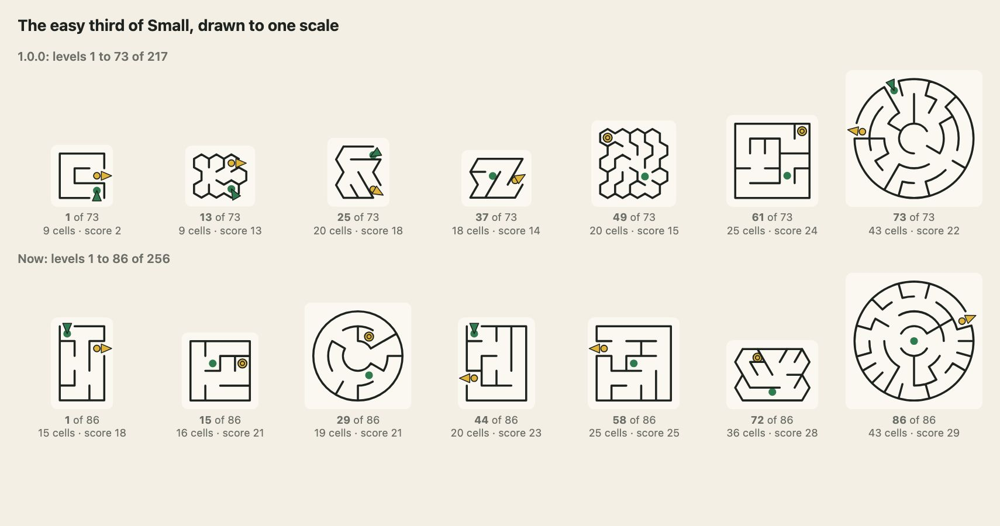

# The levels: what there are, how hard they are, and how many more there could be

Everything in the tables below is printed by `node scripts/levels-facts.ts [--capacity]`, `scripts/levels-trees.ts` and `scripts/phone-fit.mjs`; none is typed by hand. The charts and pictures are drawn by `scripts/levels-charts.mjs` and `scripts/readme-pictures.mjs`. Measured on 2026-10-02.

## The short answers

- **Are any levels locked?** No. Nothing in the package locks a level: every level of every list is open to `mountMeikyuu` and to `levelOf`, and a recipe can be played whether or not it is a level. (On the site that uses it, today no level is locked either: every level is open and Start plays the first not yet solved. Suido and Tsunagi lock blocks of 16 until the block before is solved; Meikyuu does not, and its sizes are 256 = 16 blocks of 16 for a site that wants to.)
- **Round numbers.** 256 maze levels to each of the four sizes, 1,024 in all, and 256 to each of six tall sizes, 1,536. Why 256 below.
- **Difficulty counts the map (3.0.0).** A level's score now counts how much of the map its answer covers: a maze whose answer stays in a corner counts for half what the same maze with an answer across the whole map does. Every list is in the order of that score. Section below.
- **Easy was too easy.** 62 of the 73 levels in the easy third of Small were too easy to be a level (28 of the 217 Small levels were solved by pointing at the goal and walking). Every level now has to be wrong-footed by the straight guess at least twice and cost it four cells, and the easy third has a floor that rises through it. Level 1 of Small is a 15-cell maze (3×5), not a 3×3.
- **How many more could be published?** For the squares-and-shapes lists, more than anyone will play: from 100,000 random recipes 51,835 small, 48,942 medium, 19,996 large and 5,000 huge mazes (of 5,000 drawn) were distinct and not too easy, every one a perfect maze with exactly one way through. The table is below; a safe cap of 4,096 to a size (sixteen times what is published) is reached in seconds to a minute on a laptop.
- **Vertical maps.** A whole new set: 1,536 tall levels, 2:3, six sizes (6×9 to 20×30 cells), with `orientation` to lie them down on a wide screen. 2:3 and not 1:2: the table is below.
- **Touch.** The board always leaves page beside it to scroll by (24 px a side at least, widening to 72 px with Zoom out), keeps touches only inside the box, draws with one finger and moves with two. The browser tests draw a tall maze from top to bottom by real touch, zoomed in and zoomed out, at 390×844 and 360×740, and check that the page still scrolls from the gutter and does not under the drawing finger.

## What the package holds

| Kind | Levels | Sizes and bands | On the site today |
| --- | --- | --- | --- |
| Mazes (`MEIKYUU_MAZE_LEVELS`) | 1024 | 4 sizes of 256: small, medium, large, huge; each size 86 easy, 85 medium, 85 hard | all 1,000 of the 1.0.0 list (217 small, 231 medium, 285 large, 267 huge) |
| Colossal mazes (`MEIKYUU_COLOSSAL_LEVELS`, `MEIKYUU_COLOSSAL_TALL_LEVELS`) | 256 | two lists of 128: square (about 10,000 cells) and tall (64×96) | not yet |
| Tall mazes (`MEIKYUU_TALL_LEVELS`) | 1536 | 6 sizes of 256: 6×9, 8×12, 10×15, 12×18, 16×24, 20×30; the same bands | not yet |
| Arrow puzzles (`MEIKYUU_ARROW_LEVELS`) | 300 | one list, 8 pictures, in thirds of 100 | no |
| Mixed puzzles (`MEIKYUU_MIXED_LEVELS`) | 100 | one list, in thirds (34, 33, 33) | no |

### The mazes, by size and third (now)

A *third* is the band the site derives: place 1 to 86 of a size is easy, 87 to 171 medium, 172 to 256 hard. Effort is cells drawn (`measureMaze`); score is `difficultyOf` (below); *Way* is the cells on the one way through; *Choices* are the forks on it; *Wrong turns* are forks where the straight guess goes wrong; *Straight guess wastes* is the cells that guess draws that it need not.

| Size | Band | Levels | Cells | Effort | Score | Way (cells) | Choices | Wrong turns | Dead ends | Straight guess wastes |
| --- | --- | ---: | --- | --- | --- | ---: | ---: | ---: | ---: | ---: |
| small | easy | 86 | 15–139 | 22–82 | 13–25 | 11.0 | 5.0 | 2.6 | 9.7 | 9.5 |
|  | medium | 85 | 25–143 | 33–132 | 25–34 | 21.0 | 9.0 | 3.2 | 19.2 | 17.6 |
|  | hard | 85 | 52–148 | 78–226 | 34–50 | 45.4 | 15.6 | 5.8 | 26.1 | 29.9 |
| medium | easy | 86 | 150–760 | 95–418 | 23–43 | 45.4 | 21.5 | 6.5 | 79.3 | 84.6 |
|  | medium | 85 | 156–793 | 163–620 | 44–53 | 83.6 | 26.8 | 10.0 | 84.6 | 110.6 |
|  | hard | 85 | 224–798 | 262–1203 | 53–69 | 153.4 | 32.9 | 13.2 | 102.0 | 174.6 |
| large | easy | 86 | 816–3961 | 363–1318 | 34–55 | 115.7 | 56.2 | 20.2 | 466.4 | 482.2 |
|  | medium | 85 | 806–3969 | 519–1929 | 56–67 | 205.1 | 70.2 | 26.3 | 462.6 | 661.7 |
|  | hard | 85 | 836–3952 | 706–2121 | 67–82 | 342.9 | 92.6 | 35.8 | 500.5 | 782.5 |
| huge | easy | 86 | 4096–8850 | 1094–4637 | 47–74 | 399.1 | 140.7 | 55.6 | 1583.5 | 2194.9 |
|  | medium | 85 | 4020–8911 | 1674–4930 | 74–86 | 699.5 | 170.2 | 70.5 | 1447.1 | 2364.9 |
|  | hard | 85 | 4386–8923 | 2544–4990 | 86–96 | 1042.2 | 223.8 | 96.8 | 1545.1 | 2970.8 |

### Shapes, ways to play and algorithms in every size

| Size | square | hex | triangle | circle | heart | leaf | star | ring | diamond | cross | moon | hexagon | pyramid |
| --- | ---: | ---: | ---: | ---: | ---: | ---: | ---: | ---: | ---: | ---: | ---: | ---: | ---: |
| small | 50 | 32 | 21 | 27 | 9 | 11 | 10 | 21 | 16 | 11 | 11 | 21 | 16 |
| medium | 32 | 20 | 16 | 19 | 19 | 22 | 23 | 20 | 17 | 20 | 13 | 18 | 17 |
| large | 32 | 25 | 19 | 16 | 24 | 20 | 21 | 17 | 20 | 13 | 10 | 17 | 22 |
| huge | 42 | 13 | 21 | 23 | 22 | 21 | 13 | 7 | 19 | 22 | 17 | 18 | 18 |

| Size | enter-leave | to-goal | centre-out | keys | backtracker | hunt | growing | prim | kruskal | wilson | eller |
| --- | ---: | ---: | ---: | ---: | ---: | ---: | ---: | ---: | ---: | ---: | ---: |
| small | 64 | 82 | 59 | 51 | 22 | 34 | 61 | 51 | 38 | 37 | 13 |
| medium | 59 | 44 | 58 | 95 | 61 | 47 | 44 | 25 | 38 | 37 | 4 |
| large | 56 | 69 | 73 | 58 | 41 | 46 | 40 | 39 | 42 | 42 | 6 |
| huge | 62 | 73 | 72 | 49 | 73 | 33 | 29 | 33 | 40 | 42 | 6 |

### The arrow puzzles

| square | diamond | cross | ring | heart | moon | leaf | star |
| ---: | ---: | ---: | ---: | ---: | ---: | ---: | ---: |
| 121 | 39 | 31 | 27 | 22 | 26 | 19 | 15 |

Arrow and mixed levels are untouched by this release. They are not on the site today.

## Round numbers: why 256

The site's levels page is a board of blocks of sixteen, in two rows of eight, and Suido has 256 to a size. 256 is sixteen pages of sixteen, a third of it is 85⅓ (86, 85, 85 as the site derives easy, medium and hard), and it is within reach of every size: Large and Huge of 1.0.0 had 285 and 267 good levels, so 256 cuts the hardest 29 and 11; Small and Medium had 217 and 231 and are filled to 256 with 39 and 25 new levels. 128 would have thrown away half of Large and Huge; 512 would need 295 new Small mazes of fewer than 150 cells when the 4×4 has only 100,352 different ones and a Small maze has to be small; 192 and 288 are not sixteen pages of sixteen.

## How hard a maze is to play: the score

`measureMaze` gives an **effort**: an estimate of cells drawn. It is mostly size. A 5×5 maze that the straight guess walks through and a 5×5 maze with a long wrong turn have nearly the same effort. `difficultyOf(maze)` adds what makes two mazes of one size easy or tricky, on one scale from 0 to 100:

| Term | What is counted | Weight | Ceiling (full weight at) |
| --- | --- | ---: | --- |
| reach | the effort, on the log scale `ratingOf` uses | 40% | 5,400 |
| forks | places on the way where the line could have gone another way | 15% | 400 |
| traps | forks where the **straight guess** is wrong | 15% | 160 |
| waste | cells the straight guess draws that are not on the way | 15% | 4,500 |
| depth | the longest wrong branch | 7.5% | 1,100 |
| turns | bends on the way (a heading change of more than 25 degrees) | 7.5% | 1,300 |

The straight guess is what a person does with no plan: at every fork take the passage that points most nearly at the goal, back out of dead ends, and try the next best. Each term other than reach is `ln(1 + count) / ln(1 + ceiling)`, capped at 1; the ceilings are the biggest the 1.0.0 lists reach, so the hardest maze in the lists scores in the 90s. All of it is whole numbers counted off the passages and plain arithmetic, so the same maze scores the same in every engine. Perfect mazes have no loops, so "a loop" cannot be a twist in this package; the twists are the longer wrong turn, the trap that looks like the way, and the key.

### How much of the map the answer covers (3.0.0)

The six terms count what a person meets on the way. None of them can tell a long answer across the whole map from one of the same length in a corner and one arm, and the second is the easier to play (John, 2026-10-06: a Huge cross whose answer was 134 cells of 4,736, in the middle and one arm, read four dots of five). So the score is multiplied by a factor from 0.5 to 1 (`coverageOf`, `src/coverage.ts`):

```text
score  = base * (0.5 + 0.5 * cover)          base is the six terms' weighted sum, as before
cover  = clamp((0.5 * bbox + 0.5 * zones - 0.20) / 0.70, 0, 1)
```

- `bbox`: the box that holds the answer (with the trips to its keys) over the box that holds the maze, along each axis, as a geometric mean (two axes for a flat maze, three for a solid).
- `zones`: the maze is cut into a grid of zones, **2 by 2 under 150 cells, 3 by 3 under 800 and 4 by 4 above** (a solid: 2 by 2 by 2 under 200 cells, 3 by 3 by 3 above). A zone is **visited** when the answer has at least 2 cells in it. A zone holding less than a quarter of an average zone's cells is left out, so a cross is cut to its arms and a ring to its ring. The share is of the cells' area. For a solid it is divided by 0.75 (and held to 1): a shell has no inside, so even a tour of all of it touches only about three quarters of the three-dimensional zones.
- A factor and not a seventh weighted term, because a term added gives every small maze a bonus (any answer covers a small maze): tried at weights of 0.25 to 0.40, it made 163 of 256 6×9 tall mazes read three dots where all had read two. A factor leaves a maze whose answer covers the map where it was and takes away only where the answer is small compared with the map. It is a discount, never a promotion: no level scores more than before, and the hardest Huge levels (full cover, answers of 600 to 2,100 cells) are untouched.
- **Dots stay absolute across sizes.** A site that shows a score as dots cuts it at 20, 40, 60 and 80 (`ceil(score / 20)`, one to five), the same for every size and list, so Small never reaches four dots and Huge never shows one. The score is rounded once, then cut.

Measured over all 3,776 levels of the lists with levels (1,024 square mazes, 1,536 tall, 256 colossal, 960 solids), the dots of 1, 2, 3, 4 and 5, 2.3.0 and now:

| List | 2.3.0 | 3.0.0 |
| --- | --- | --- |
| Small | 16, 190, 50, 0, 0 | 39, 174, 43, 0, 0 |
| Medium | 0, 9, 200, 47, 0 | 0, 55, 170, 31, 0 |
| Large | 0, 0, 21, 225, 10 | 0, 14, 103, 135, 4 |
| Huge | 0, 0, 0, 30, 226 | 0, 0, 17, 118, 121 |
| Colossal, both lists | 0, 0, 0, 21, 235 | 0, 0, 16, 58, 182 |
| Tall, six sizes | 0, 523, 889, 124, 0 | 1, 720, 705, 110, 0 |
| Solids, 15 lists | 0, 300, 597, 63, 0 | 0, 526, 404, 30, 0 |
| All | 16, 1,022, 1,757, 510, 471 | 40, 1,489, 1,458, 482, 307 |

861 levels (23%) lose a dot, 10 lose two, none gains one. The median score of Small went from 32 to 29, Medium 53 to 48, Large 70 to 61, Huge 87 to 80. The biggest falls, each an answer of a few per cent of the cells in one part of the map: Huge `cross:90:growing:centre-out:18570` (the first Huge level of 2.3.0) 76 to 47, four dots to three, a cover of 0.25 and a factor of 0.63; `cross:92:kruskal:centre-out:28535` 75 to 47; Large `diamond:89:prim:centre-out:19128` 75 to 47; Large `leaf:99:growing:to-goal:33664` 74 to 47; Colossal `hexagon:59:kruskal:to-goal:1769128033` 86 to 58; Large `circle:31:hunt:centre-out:24939` 63 to 37. The Huge crosses by how many arms the answer works in: `cross:88:prim:enter-leave:45675` 82 to 61, `cross:120:prim:to-goal:48155` 85 to 64, `cross:97:growing:to-goal:37725` 82 to 67, `cross:118:backtracker:centre-out:1791460` (an answer of 1,383 cells in two arms) 85 to 68. The family's rule, for every package that has levels, is written once in [LEVELS-STANDARD.md](https://github.com/johnmorrisdotca/.github/blob/main/LEVELS-STANDARD.md).

**Too easy** (`isTooEasy`): a maze that has fewer than 4 cells the straight guess draws in vain, fewer than 2 traps, fewer than 3 forks on the way, fewer than 3 wrong branches or fewer than 4 dead ends. Until 3.0.0 the easy third of a size also had a floor that rises (`easyFloorAt`, still exported but no longer asked of a list, which is now in the order of its score): at place 1 the least, at place 86 3 traps, 5 forks and 8 wasted cells.

### The easy third, before and after

| Size | Levels | Too easy to keep | Of them, the straight guess walks straight to the goal | In the easy third |
| Size | L1 | L5 | L10 | L20 | L40 | L60 | L86 | L128 | L171 | L214 | L256 |
| --- | ---: | ---: | ---: | ---: | ---: | ---: | ---: | ---: | ---: | ---: | ---: |
| small, 1.0.0 (level at the same place in its 217) | 2 | 5 | 12 | 10 | 15 | 17 | 21 | 28 | 31 | 33 | 43 |
| small, now | 13 | 15 | 17 | 18 | 21 | 22 | 25 | 29 | 34 | 41 | 50 |
| medium, 1.0.0 (level at the same place in its 231) | 23 | 25 | 32 | 36 | 39 | 41 | 42 | 48 | 51 | 46 | 65 |
| medium, now | 23 | 30 | 32 | 34 | 39 | 41 | 43 | 48 | 53 | 59 | 69 |
| large, 1.0.0 (level at the same place in its 285) | 35 | 37 | 39 | 41 | 66 | 46 | 66 | 73 | 68 | 79 | 83 |
| large, now | 34 | 37 | 40 | 42 | 48 | 52 | 55 | 61 | 67 | 72 | 82 |
| huge, 1.0.0 (level at the same place in its 267) | 47 | 53 | 62 | 59 | 77 | 75 | 65 | 88 | 86 | 89 | 95 |
| huge, now | 47 | 57 | 59 | 61 | 66 | 69 | 74 | 80 | 86 | 89 | 96 |

| Size | L1 | L5 | L10 | L20 | L40 | L60 | L86 | L128 | L171 | L214 | L256 |
| --- | ---: | ---: | ---: | ---: | ---: | ---: | ---: | ---: | ---: | ---: | ---: |
| small, 1.0.0 (level at the same place in its 217) | 2 | 7 | 15 | 10 | 19 | 19 | 22 | 31 | 36 | 34 | 43 |
| small, now | 18 | 20 | 20 | 21 | 22 | 25 | 29 | 33 | 37 | 44 | 44 |
| medium, 1.0.0 (level at the same place in its 231) | 36 | 41 | 38 | 44 | 46 | 47 | 50 | 48 | 53 | 61 | 65 |
| medium, now | 36 | 41 | 45 | 40 | 45 | 47 | 48 | 51 | 57 | 65 | 69 |
| large, 1.0.0 (level at the same place in its 285) | 57 | 58 | 59 | 62 | 68 | 68 | 66 | 73 | 68 | 79 | 83 |
| large, now | 57 | 55 | 61 | 59 | 66 | 69 | 64 | 67 | 77 | 76 | 78 |
| huge, 1.0.0 (level at the same place in its 267) | 76 | 75 | 81 | 81 | 83 | 87 | 84 | 88 | 86 | 91 | 95 |
| huge, now | 76 | 75 | 81 | 80 | 84 | 84 | 88 | 84 | 94 | 87 | 93 |




Small's easy third used to begin with a 3×3 and score 2 to 26 with 1.1 wrong turns on average; it now scores 18 to 29, from a 15-cell maze to a 48-cell one, with 2.7 wrong turns on average, and the floor rises through it. Medium, Large and Huge were not too easy (Medium lost 7 mazes); their tables above match 1.0.0's closely because most of their levels are the same levels.

The lists were ordered by effort until 3.0.0, as the first release promised ("no level is easier to draw than the one before"). Since 3.0.0 each list is in the order of the score (`scripts/meikyuu-rescore.ts`: the unrounded score, then the effort, then the old place), so a level is never scored under the one before it, and a size's levels climb the dots of a site in order. The effort still rises along a size on the whole (the score is 40% effort), but one level can cost more to draw than the one after it. Each 'now' row above is in the new order.

## What changed, and what a site must do

| Size | Band | Levels | Cells | Effort | Score | Way (cells) | Choices | Wrong turns | Dead ends | Straight guess wastes |
| --- | --- | ---: | --- | --- | --- | ---: | ---: | ---: | ---: | ---: |
| small (217) | easy | 73 | 9–43 | 9–41 | 2–24 | 10.2 | 3.5 | 1.1 | 7.0 | 4.1 |
|  | medium | 72 | 28–107 | 41–81 | 14–36 | 18.3 | 8.0 | 2.3 | 15.3 | 10.4 |
|  | hard | 72 | 56–144 | 82–167 | 21–43 | 31.6 | 12.7 | 3.9 | 26.6 | 23.4 |
| medium (231) | easy | 77 | 150–346 | 95–230 | 21–50 | 45.7 | 18.5 | 5.5 | 53.7 | 51.1 |
|  | medium | 77 | 184–760 | 232–360 | 33–58 | 73.1 | 27.4 | 9.8 | 92.6 | 106.2 |
|  | hard | 77 | 281–793 | 364–961 | 42–65 | 126.1 | 33.6 | 13.2 | 117.7 | 169.2 |
| large (285) | easy | 95 | 806–3344 | 363–838 | 34–69 | 116.6 | 54.6 | 19.7 | 365.9 | 354.4 |
|  | medium | 95 | 836–3969 | 840–1320 | 37–76 | 209.6 | 76.0 | 28.9 | 515.1 | 722.3 |
|  | hard | 95 | 1444–3997 | 1321–4163 | 56–87 | 528.6 | 96.9 | 39.4 | 530.9 | 974.3 |
| huge (267) | easy | 89 | 4096–8911 | 1094–2549 | 47–88 | 276.2 | 165.6 | 64.2 | 1813.8 | 2272.3 |
|  | medium | 89 | 4020–8910 | 2581–3721 | 57–94 | 674.7 | 186.6 | 79.8 | 1563.4 | 2752.4 |
|  | hard | 89 | 4454–8923 | 3736–5371 | 64–96 | 1297.5 | 175.3 | 76.4 | 1112.2 | 2531.8 |

A size keeps its **places**. The first release's levels, by size and place (the site's "size and level number"):

| Size | 1.0.0 places | Same maze, same place | A new maze at the place (the old one was too easy) | Added at the end | Gone (cut off the end) |
| --- | ---: | ---: | --- | ---: | --- |
| Small | 217 | 109 | 108: places 1–37, 39–52, 54–59, 62–70, 72–73, 76–89, 94–95, 99, 101–102, 106, 110, 114–117, 120–123, 127–128, 136, 138, 146, 148, 156, 169, 172, 179, 190 | 39 (218–256) | none |
| Medium | 231 | 222 | 9: places 23, 25, 31, 33, 45–46, 52, 140, 147 | 25 (232–256) | none |
| Large | 285 | 256 | none | 0 | 29: places 257–285 |
| Huge | 267 | 256 | none | 0 | 11: places 257–267 |

843 of the 1,000 stay at the same place with the same maze. **Compatibility breaks, all of them:**

1. `MEIKYUU_MAZE_LEVELS` is 1,024 long and ordered by size, so the *global* number of every level from 218 up changes (a level's number in its size does not, apart from the rows above). Anything that stored a global number (a link, a kept run) needs the map. This is why this is a **major release (2.0.0)**: the first release said a level keeps its number.
2. 108 Small and 9 Medium places hold a different maze. A solve kept **by recipe** is still a solve of the maze it was (a recipe never changes what it builds); a solve kept by "size and place" now names the new maze. The new maze is about as hard as the old was meant to be, never easier to draw than the place before it.
3. 40 levels (the hardest 29 of Large and 11 of Huge) are not levels any more. They are still playable as recipes.
4. The effort no longer rises along the whole list (Medium begins easier than Small ends).

**The migration answer is data, exported as `@johnmorrisdotca/meikyuu/levels/legacy`:** `MEIKYUU_LEGACY_MAZE_LEVELS`, `legacyLevelOf(oldNumber)`, `legacyLevelOfCode(recipe)`. Each row has the recipe, `size`, `place` (the number in its size in 1.0.0), `now` and `nowInSize` (where the same maze is now, or null), and `nearest` (the level now at its place). A site with solves by recipe keeps them as they are and uses `legacyLevelOfCode` to mark the retired ones; a site with solves by place finds them in `nearest`. The demo does this for a visitor's saved progress.

## 3.0.0: the score counts the map, and every list is in its order (a major release)

**What a site must do.** Nothing in the package's API is removed (`MazeGeometry` gains `points`, which `difficultyOfGraph` needs; a `MazeDifficulty` gains `base` and `coverage`), but **a level's number names a different maze**: every list (the four maze sizes, the six tall sizes, the two colossal lists, the 15 solid lists) has the same 256, 128 or 64 recipes as 2.3.0, in a new order. The sets did not change, so:

1. **A solve kept by recipe is still a solve of that maze**, whatever number it has now. A site that finds a level by its recipe (`levelsOf(...).find((l) => l.code === code)`) needs nothing.
2. **A solve, a kept run or a link kept by "size and number"** now names whichever maze stands at that number. 2.3.0's list is not kept in the package (it would be 3,776 recipes again): a site that kept numbers reads its own solves' recipes. A run half drawn on a number is drawn against the new maze there, and is cleared by a site that checks its line against the maze.
3. **The thirds** (`bandOf`: easy, medium, hard by place) follow the score, so a level's third may change; a site that filed solves under their third at the time keeps filing those.
4. `legacyLevelOf` and `levels/legacy` now answer from the new lists: `now` and `nowInSize` are where a 1.0.0 maze stands in the new order; `nearest` is the same maze where it is still a level, else the level of its size scoring nearest.
5. Scores moved (the table above): a site's dots are `ceil(score / 20)` of the new integer.

## The levels of the solids (3.1.0)

5,760 levels: 18 solids, 5 sizes each (small, medium, large, huge, colossal), 64 to a list, each list in the order of its score, in three files (`3d/levels`, `3d/levels/dice`, `3d/levels/shapes`; `3d/levels/all` has them all). The first score of a list, and the last, with the cells of the size (`node --experimental-strip-types scripts/meikyuu-rescore.ts` writes them in order; the table is read off the data):

| Solid | small (cells, scores) | medium (cells, scores) | large (cells, scores) | huge (cells, scores) | colossal (cells, scores) |
| --- | --- | --- | --- | --- | --- |
| prism (d3) | 72: 24–41 | 288: 31–57 | 648: 37–66 | 1352: 43–75 | 4232: 51–91 |
| tetrahedron (d4) | 100: 24–41 | 256: 30–52 | 576: 33–62 | 1296: 42–75 | 4356: 51–91 |
| cube (d6) | 96: 24–42 | 294: 31–54 | 600: 36–62 | 1350: 45–77 | 4374: 54–91 |
| octahedron (d8) | 72: 22–38 | 288: 27–53 | 648: 33–63 | 1352: 41–76 | 4232: 50–91 |
| trapezohedron (d10) | 90: 25–45 | 250: 30–56 | 640: 37–66 | 1210: 41–76 | 4410: 49–91 |
| dodecahedron (d12) | 60: 23–39 | 240: 29–56 | 540: 35–64 | 1500: 42–77 | 4860: 50–92 |
| rhombic-dodecahedron (d12) | 108: 26–47 | 300: 30–58 | 588: 35–67 | 1200: 40–74 | 4332: 49–92 |
| bipyramid (d16) | 64: 23–40 | 256: 29–55 | 576: 35–65 | 1296: 41–76 | 4624: 49–92 |
| icosahedron (d20) | 80: 23–39 | 320: 31–55 | 720: 36–64 | 1280: 42–75 | 4500: 51–91 |
| icositetrahedron (d24) | 96: 26–45 | 384: 32–60 | 600: 36–67 | 1176: 40–74 | 4704: 49–93 |
| triacontahedron (d30) | 120: 28–48 | 270: 30–58 | 750: 39–68 | 1470: 44–77 | 4320: 51–92 |
| sphere | 92: 26–41 | 252: 27–52 | 642: 35–63 | 1212: 42–74 | 4412: 51–92 |
| box | 88: 26–44 | 352: 34–61 | 550: 38–64 | 1408: 44–76 | 4312: 53–92 |
| cross | 120: 27–47 | 270: 29–57 | 750: 37–69 | 1470: 41–77 | 3630: 48–90 |
| ring | 128: 29–49 | 288: 31–57 | 800: 39–69 | 1152: 42–74 | 3872: 50–90 |
| torus | 75: 26–42 | 300: 33–58 | 675: 40–67 | 1323: 45–75 | 4332: 54–91 |
| star | 60: 22–40 | 240: 30–56 | 600: 36–66 | 1260: 42–75 | 3600: 48–89 |
| heart | 80: 25–42 | 320: 32–58 | 720: 37–68 | 1280: 42–75 | 3920: 50–90 |

The top of the scale takes about four thousand cells: a maze of twelve hundred cannot reach it (the hardest huge level of any solid scores 74 to 77), and the colossal lists end at 89 (the star, 3,600 cells) to 93 (the deltoidal icositetrahedron). The star, the heart, the cross and the ring are cut to 3,600 to 3,900 cells and not 4,400 because a solid whose parts hide parts takes about twice as long to paint (`docs/SOLIDS.md`).

## How many more could be published

| Size | Drawn | Seconds | ms a maze | Hard enough (not too easy) | Distinct | Easy-band scores | Medium-band | Hard-band |
| --- | ---: | ---: | ---: | ---: | ---: | ---: | ---: | ---: |
| small | 100,000 | 7 | 0.1 | 51,835 | 51,835 | 10,572 | 24,087 | 17,176 |
| medium | 50,000 | 18 | 0.4 | 48,942 | 48,942 | 15,061 | 22,210 | 11,671 |
| large | 20,000 | 50 | 2.5 | 19,996 | 19,996 | 3,529 | 12,919 | 3,548 |
| huge | 5,000 | 39 | 7.9 | 5,000 | 5,000 | 3,822 | 1,090 | 88 |

*Hard enough* are the draws that pass `isTooEasy`; *Distinct* are those whose structure (shape, dimensions, way to play, start, goal, keys and the tree) is not the same as another's; the three *band* columns count the distinct ones whose score falls in the range of that third of the published size (Small: up to 29, to 39, above; and so on). A draw is a random recipe in the size's cell range, with every shape, way to play and algorithm; the hard bands are rare among random draws (88 of 5,000 Huge draws) because the hardest mazes are made by the long winding algorithms and a recipe is drawn that way by a targeted search, as the end of Small and Medium were made.

**Can the generator make more from more seeds?** Yes, without limit for any size above the smallest. A recipe's seed is a 32-bit integer and the algorithm, the shape, the dimensions and the way to play are separate choices, so there are about 4 billion mazes for each combination. Every maze is a spanning tree of its cells, so it is perfect (exactly one way between any two cells) by construction, and `candidateOf` checks it again with `isPerfect` before a draw is kept; every published level is also solved by drawing its way with the game's own rules on every build. What does limit it is the smallest grids, which have only so many different mazes. The most there can be on a grid is its number of spanning trees (Kirchhoff's matrix-tree theorem, computed exactly):

| Grid | Cells | Different mazes (spanning trees) |
| --- | ---: | ---: |
| square 3×3 | 9 | 192 |
| square 4×3 | 12 | 2,415 |
| square 4×4 | 16 | 100,352 |
| square 5×4 | 20 | 4,140,081 |
| square 5×5 | 25 | 557,568,000 |
| square 6×6 | 36 | 3.25 × 10^13 |
| square 7×7 | 49 | 1.98 × 10^19 |
| square 8×8 | 64 | 1.26 × 10^26 |
| square 10×10 | 100 | 5.69 × 10^42 |
| hex 4×4 | 16 | 14,682,473 |
| hex 6×6 | 36 | 1.32 × 10^19 |
| triangle 8×4 | 32 | 5,379,072 |
| circle 3 | 19 | 107,794,125 |
| circle 5 | 67 | 1.59 × 10^31 |
| hexagon 2 | 19 | 2,300,606,464 |
| hexagon 4 | 61 | 6.14 × 10^35 |
| square 6×9 | 54 | 2.66 × 10^21 |
| square 8×12 | 96 | 5.26 × 10^40 |
| square 10×15 | 150 | 1.28 × 10^66 |
| square 12×18 | 216 | 3.84 × 10^97 |

So the 3×3 has 192 mazes and the 4×4 100,352 (before the choice of start and goal multiplies them); from 5×5 up there are more than anyone will ever play. **Safe cap:** 4,096 levels to a size (sixteen times the published 256) is within what was drawn for Small and Medium (12× over), Large (4.9×) and, with every one of the 5,000 draws distinct and not too easy, Huge (1.2×; more were not drawn). The draws in the table took 7 seconds (Small), 18 (Medium), 50 (Large) and 39 (Huge) on a laptop (0.1, 0.4, 2.5 and 7.9 ms a maze, built and measured). The generator is `scripts/meikyuu-levels.ts`; new levels would be a new file added to the end (a new version), never a rewrite.

The arrow list (300) and the mixed list (100) are made the same way (`scripts/meikyuu-arrows.ts`): an arrow board is built backwards so that it can always be cleared, so more seeds mean more boards with the same guarantee; they are not on the site, and nothing was measured for them here.

## Tall maps

A tall maze is an ordinary maze with a tall recipe (`square:10x15:...`), two columns of cells to three rows, in a box two thirds as wide as it is tall. **I built 2:3 and not 1:2.** What a phone held upright leaves for the maze, once the page's header and the board's own buttons and words are paid for (284 px, as a 390×844 phone leaves 390×560), less a gutter of 24 px each side:

| Phone (CSS px) | Left for the maze | 1:1 box | 4:5 box | 2:3 box | 3:5 box | 1:2 box |
| --- | --- | --- | --- | --- | --- | --- |
| iPhone SE (2022) 375×667 | 327 × 383 | 327 × 327 (100%) | 306 × 383 (94%) | 255 × 383 (78%) | 230 × 383 (70%) | 192 × 383 (59%) |
| Galaxy S23 360×780 | 312 × 496 | 312 × 312 (100%) | 312 × 390 (100%) | 312 × 468 (100%) | 298 × 496 (95%) | 248 × 496 (79%) |
| Small Android 360×740 | 312 × 456 | 312 × 312 (100%) | 312 × 390 (100%) | 304 × 456 (97%) | 274 × 456 (88%) | 228 × 456 (73%) |
| iPhone 15 390×844 | 342 × 560 | 342 × 342 (100%) | 342 × 428 (100%) | 342 × 513 (100%) | 336 × 560 (98%) | 280 × 560 (82%) |
| Pixel 7 412×915 | 364 × 631 | 364 × 364 (100%) | 364 × 455 (100%) | 364 × 546 (100%) | 364 × 607 (100%) | 316 × 631 (87%) |

(The percentage is the width of the box against the width the phone leaves.) 2:3 uses the full width on every phone but the iPhone SE (78%); 1:2 loses 13 to 41% of the width, and a 1:2 maze 12 cells across has cells of 16 px on the SE and 23 on an iPhone 15 where 2:3 has 21 and 28:

| Phone | Ratio | a cell with 12 across | a cell with 16 across | a cell with 20 across |
| --- | --- | ---: | ---: | ---: |
| iPhone SE (2022) | 1:1 | 27.3 px | 20.4 px | 16.4 px |
| iPhone SE (2022) | 2:3 | 21.3 px | 16.0 px | 12.8 px |
| iPhone SE (2022) | 1:2 | 16.0 px | 12.0 px | 9.6 px |
| iPhone 15 | 1:1 | 28.5 px | 21.4 px | 17.1 px |
| iPhone 15 | 2:3 | 28.5 px | 21.4 px | 17.1 px |
| iPhone 15 | 1:2 | 23.3 px | 17.5 px | 14.0 px |

On the iPhone 15 the room is 342×560, a ratio of 0.61, so 3:5 would fit it best; 2:3 is the nearest ratio with whole numbers of cells for squares (6×9, 8×12, ...) and loses 2% of the width. A 1:2 "tower" is not built; the package takes any recipe, so a site that wants one can make its own (`orientation` and the touch design below work for any ratio).

### The six sizes

| Size | Band | Levels | Cells | Effort | Score | Way (cells) | Choices | Wrong turns | Dead ends | Straight guess wastes |
| --- | --- | ---: | --- | --- | --- | ---: | ---: | ---: | ---: | ---: |
| 6×9 | easy | 86 | 45–54 | 46–74 | 20–30 | 15.3 | 7.0 | 3.2 | 14.6 | 19.4 |
|  | medium | 85 | 45–54 | 48–82 | 30–33 | 23.8 | 7.4 | 3.4 | 11.3 | 13.6 |
|  | hard | 85 | 45–54 | 61–83 | 33–38 | 22.6 | 12.2 | 5.1 | 15.5 | 13.9 |
| 8×12 | easy | 86 | 91–100 | 73–111 | 25–35 | 22.1 | 9.6 | 3.8 | 25.7 | 28.8 |
|  | medium | 85 | 91–100 | 78–135 | 35–39 | 34.0 | 10.9 | 4.2 | 22.1 | 25.5 |
|  | hard | 85 | 91–100 | 97–137 | 39–45 | 37.6 | 16.9 | 6.9 | 24.9 | 27.2 |
| 10×15 | easy | 86 | 144–156 | 100–154 | 25–37 | 29.1 | 11.7 | 4.2 | 38.9 | 39.4 |
|  | medium | 85 | 144–156 | 102–197 | 37–43 | 46.2 | 14.8 | 5.1 | 33.8 | 40.6 |
|  | hard | 85 | 144–156 | 133–198 | 43–50 | 53.0 | 22.4 | 8.9 | 38.1 | 43.1 |
| 12×18 | easy | 86 | 210–220 | 129–224 | 28–40 | 34.9 | 16.0 | 5.1 | 58.0 | 59.8 |
|  | medium | 85 | 210–220 | 142–274 | 40–47 | 66.1 | 17.2 | 6.1 | 44.2 | 59.6 |
|  | hard | 85 | 210–220 | 190–276 | 47–55 | 66.4 | 31.1 | 12.5 | 57.0 | 64.2 |
| 16×24 | easy | 86 | 350–399 | 191–378 | 30–48 | 53.2 | 21.6 | 7.2 | 96.2 | 105.7 |
|  | medium | 85 | 350–399 | 230–465 | 48–55 | 90.5 | 26.0 | 8.9 | 79.4 | 108.2 |
|  | hard | 85 | 350–399 | 300–472 | 55–62 | 118.4 | 44.1 | 18.6 | 88.8 | 125.5 |
| 20×30 | easy | 86 | 576–600 | 263–519 | 34–54 | 69.2 | 29.4 | 9.7 | 154.0 | 149.7 |
|  | medium | 85 | 576–600 | 345–729 | 54–61 | 153.7 | 30.3 | 11.5 | 100.7 | 173.4 |
|  | hard | 85 | 576–600 | 463–730 | 61–67 | 163.8 | 55.9 | 23.4 | 133.9 | 201.5 |

A size has about as many cells in every shape (a hexagon or triangle maze has smaller cells, so the same number of them fills the same box with bigger cells), and the squares are the whole numbers 6×9, 8×12, 10×15, 12×18, 16×24 and 20×30. In a 342-px box, 6, 8, 10 and 12 across are cells of 57, 43, 34 and 28 px; 16 and 20 across are 21 and 17 px and want zoom on a phone, which is what the touch design is for. Every level has the floor of the end of the easy third from its first place (the smallest has 45 cells, so it can be asked). Shapes are balanced through every third; the ways to play are balanced too, except the hard third of the largest size, where the keys' detours put most of the high efforts.


### Turning

`orientation: "portrait" | "landscape" | "auto"` (default `auto`). The picture is turned a quarter counter-clockwise (the maze's top ends up on the left); the maze, its cells and the line drawn are as they were made. `auto` looks at the room: the host's width less the gutters, and the window's height less `reserve` (200 px, and not under 60% of the window). It turns the maze when that makes it bigger by more than a twelfth, so a phone upright keeps a tall maze upright, a phone on its side or a desk lies it down, a square room or a square maze is never turned, and a host that sets a square box is not turned either. The host adds a choice with `mount.orientation(setting)` (the demo has Auto, Upright, Lying down), and `meikyuu-orientation` fires when a resize makes `auto` decide again.

A line is the same line either way up. A pointer's path over the picture is carried back into the maze (`cellsAlong`, one function used by the board and the tests) before the game hears of it, and a line stored as its steps (`lineToSteps`: one base-36 character a step, the place of the next cell among the neighbours of the one before) is the same string. **Tested for all 13 shapes and all four ways to play** in `src/orientation.test.ts` (the path and steps drawn upright and turned are equal), and **in a real browser for all 13 shapes** (`e2e/orientation.demo.mjs`: the first 8 cells of the way drawn with the mouse on a board shown each way up read back the same cells and steps; and a line begun upright and finished lying down is the whole way).


## Touch: one finger draws, so something else must scroll

The worry: a maze that fills the window leaves nowhere to put a finger to scroll the page, and a finger drawing must not scroll it. As built (`src/mount.ts`, `src/surface.ts`, `src/playStyle.ts`):

1. **Gutters.** The box is never wider than the window less `gutter` each side (24 px by default; CSS `min(100%, 100vw - 2*gutter, max(100dvh - reserve, 60dvh) * aspect)`), and the page beside it is the browser's.
2. **`touch-action: none` on the box only.** Everything else, the host included, has `pan-y pinch-zoom`, so a swipe in a gutter, on the buttons or on the words scrolls the page and the page can still be pinched. The box also has `overscroll-behavior: contain`.
3. **Zoom out far enough to see the body.** Zoom out (the pad's − or two fingers coming together) shrinks the maze to a little past the fit and then widens the gutters, 24 → 48 → 72 px a side (`MEIKYUU_GUTTER_MAX`), and Zoom in (or fingers apart) brings them in first. It only does this where the page would show: not on a desk where the host is already narrow. `mount.gutter(px)` sets it; Fit puts it back.
4. **Fit** is `both` (the whole maze), `width` or `height` (`fit` option, `mount.fit(mode)`); a board bigger than the box in a direction starts at its top or left. A box that is resized (the gutters widening) keeps its zoom relative to the fit and the middle of what it shows, so a narrower box does not crop a fitted maze.
5. **Two fingers pan and pinch** a zoomed maze; one finger pressed away from the line's end moves the view too (a hand on a map); one finger on the end of the line draws. The **Move** button (`mount.pan(true)`, `pan` option) makes every one-finger drag move the view, for a mouse or a finger that cannot find the line's end.
6. **Edge auto-pan** while drawing: gentle (nothing 44 px from the edge, rising to 7 px a frame at the edge), off with `edgePan: false` or `edge-pan="off"`.

`e2e/touch.demo.mjs` (Chromium at 390×844, at 360×740, and WebKit for the parts that need no CDP) checks: the box is at least 24 px from both sides of the window; its `touch-action` is `none` and the host's has `pan-y`; **a real touch swipe (Chromium's `synthesizeScrollGesture`) on the box scrolls nothing and draws nothing, and the same swipe in the gutter scrolls the page**; a tall maze is drawn from its top to its bottom by one touch at the size the box fits, at 360 across, zoomed in a stretch at a time with two fingers moving the view between (the page does not move through any of it), and zoomed out with the gutters at 72 px (with the page scrolling from the gutter between); two fingers move a zoomed maze and draw nothing; the Move button; a pinch widens the gutters and the opposite pinch narrows them; and a line held at the edge moves the view or not as asked.

## Colossal mazes (2.1.0)

The biggest the lists go: two lists of 128 in an entry of their own (`@johnmorrisdotca/meikyuu/levels/colossal`), made by `scripts/meikyuu-colossal.ts` on 2026-10-05 from two pools of 6,000 mazes each, a ramp of the effort from the 3rd percentile to the 97th, as the tall lists are.

| List | Levels | Cells | Effort | Score | Rating | Shapes and ways to play |
| --- | ---: | ---: | ---: | ---: | ---: | --- |
| Square (`MEIKYUU_COLOSSAL_LEVELS`) | 128 | 9,514 to 11,995 | 1,744 to 9,762 | 80 to 99 | 83 to 100 | all 13 shapes (8 to 13 levels each); to-goal 31, centre-out 31, enter-leave 33, keys 33 |
| Tall (`MEIKYUU_COLOSSAL_TALL_LEVELS`) | 128 | 6,059 to 6,144 (64×96 for a square one) | 1,224 to 6,008 | 71 to 95 | 77 to 100 | square 44, hex 42, triangle 42; to-goal 28, centre-out 27, enter-leave 29, keys 44 |

- **Why 128 and not 256, and why recipes.** A level is a recipe (about 60 characters), so a list is 17 KB for both, and the maze is built from its seed where it is played: 20 to 65 ms in Node for ten thousand cells (the cut-out shapes, which are built from a raster two to three times as big, take the most). Nothing is generated ahead and nothing needs to be generated on demand beyond that. Colossal mazes take much longer to solve than a huge one (the way through is up to 5,009 cells), so eight pages of sixteen is plenty.
- **The scoring is the same.** `difficultyOf` is unchanged, its terms still scaled to the biggest the older lists reach, so the colossal scores run 71 to 99 and the order inside a list is by effort, which has more room. A colossal square maze is harder than every huge one at the top (9,762 against 4,990), and the smallest of them has more cells than the biggest huge one (9,514 against 8,923). `isTooEasy` holds every one.
- **Why the tall one is 64×96.** The tall sizes' recipe form (`square:64x96:…`) and `tallDimensions` already serve it (hexagons 59×103, triangles 83×73, both 2:3 within a few per cent): a width of 80 would need 120 rows, the most `tallDimensions` looks at. 6,144 cells on a phone 342 px across is 5 px a cell at the fit: zoom is the way in, as for every big maze.
- **Cut-out shapes in the square list** are cut from a raster up to 190 across (36,100 cells laid out), inside `MEIKYUU_MOST_CELLS` (40,000), so a recipe is still refused above what any level lays out.

### Drawing a line ten thousand cells wide, measured

Chromium 1.63 on the Mac, a 390×844 touch viewport, CPU slowed four times (`Emulation.setCPUThrottlingRate`, about a mid-range phone), the demo page, the colossal square level with the longest way through (`ring:143:backtracker:centre-out`, 5,009 cells), a finger crossing six cells a frame from the start to the goal, then 40 wheel zooms and 120 pointer moves of a pan:

| | before | after |
| --- | ---: | ---: |
| Cost of the six pointer events of a frame (mean) | 22.6 ms | 6.1 ms |
| Frames while drawing (mean / 95th percentile) | 28.3 / 50.0 ms | 16.7 / 16.7 ms |
| Frames while zooming and panning (mean / 95th percentile) | 16.6 / 16.7 ms | 16.7 / 16.7 ms |
| Page ready, with the maze built from its recipe | 569 ms | 551 ms |

The cost was the line: every pointer event rebuilt the whole `d` attribute of the line (5,009 points) and the game copied the line, so a line of n cells cost n for each of n cells. The line is now kept as text with where each cell's piece ends (`mazeSurface.ts`): a maze is a tree, so two lines from the start that are the same at one place are the same up to it, the part kept is found by a binary search, and only the cells after it are written; the attribute is set once a frame. Walls were already cut into tiles of ten cells drawn only while on screen, so zooming and moving were at the frame rate before and after, and **the board stays SVG**: canvas would have been a second renderer for no gain. The tall list (3,033 cells the longest way) measured 12.7 ms for the six events before the change and 5.7 now, at 16.7 ms frames. A line of more than 600 cells does not ripple on winning (the ripple repaints the whole line each frame).

`e2e/colossal.demo.mjs` holds what must stay true: the line's text is `linePath` of the game's own path after every kind of change (drawn on, cut back by three hundred, drawn on down another way, undone, restarted), on the longest way of each list.

One thing found and not explained: **WebKit on Linux** (software painting, Playwright's `webkit` in the official Linux image) stalls for twenty to seventy seconds a frame once a line of five thousand cells is on the demo page and the page changes anything (it does when it hears the win, and when a button is clicked). The package's own board in a bare page does not (27 ms), WebKit on a Mac does not, Chromium on Linux does not, and an empty maze on the demo page does not. The 2.0.1 demo's own huge-maze smoothness test (`e2e/zoom.demo.mjs`) fails in that engine too, so it is that engine's software painting of an SVG this big and not a cost of this release; the browser test that draws the long line skips that one engine.

## Making them again

```sh
node scripts/meikyuu-levels.ts       # the square lists, from the 1.0.0 list (about two minutes)
node scripts/meikyuu-tall.ts         # the tall lists (about a minute)
node --experimental-strip-types scripts/meikyuu-colossal.ts   # the colossal lists (about six minutes)
pnpm levels:rescore                  # last: score every level again and put every list in the order of its score (ten seconds)
node scripts/levels-facts.ts --capacity > facts.md    # the tables (about two minutes more)
node scripts/levels-trees.ts         # spanning trees
node scripts/phone-fit.mjs           # the phone table
node scripts/levels-charts.mjs       # the charts and the easy-third picture (pnpm build first)
node scripts/readme-pictures.mjs     # the demo's pictures (pnpm site first)
```
